# sonar-representation-lab

GitHub: [public repository](https://github.com/Kripta-Studios/sonar-representation-lab).
Code, tests, reports and small research outputs are tracked in Git. Full model checkpoints,
predictions, evaluator outputs, interrupted attempts and pinned DINOv2 source are distributed as
independent ZIP volumes in the [research snapshot release](https://github.com/Kripta-Studios/sonar-representation-lab/releases/tag/research-2026-10-04).
The release manifest records every included path, size and SHA-256. Raw CFC images and the Python
environment are excluded; obtain the official data and use the pinned environment instructions below.
There are 22 ZIP volumes: 21.93 GB to download and 32.17 GB of restored files, covering 1,807 paths.
Allow at least 55 GB of free space for both archives and restored artifacts, separately from the data
and Python environment.
Cached third-party webpages and reference copies remain local; their original source links, factual
provenance and license records are retained. The archive includes the licensed pinned DINOv2 source.

To restore the research artifacts into a clone, download the release ZIPs and manifest, then run:

```powershell
git -c core.autocrlf=false clone https://github.com/facebookresearch/dinov2.git vendor/dinov2
git -C vendor/dinov2 checkout 7764ea0f912e53c92e82eb78a2a1631e92725fc8
gh release download research-2026-10-04 --repo Kripta-Studios/sonar-representation-lab --dir artifacts/github-publication
python scripts/github_artifacts.py restore --assets artifacts/github-publication
```

The restore command verifies asset and individual-file hashes and preserves differing existing files.
Tracked scientific files retain their original bytes to preserve frozen source and evaluator identities.
Skip the dependency clone if the existing DINOv2 checkout is already at the pinned revision. Its Git
metadata is deliberately not bundled; model loading verifies the dependency's actual checked-out commit.

Latest completed follow-up: The seed-7 image branch passes the practical screen. B initialization provides no label-efficiency improvement in the completed matched pilot. Primary AP50 change +1.7295 percentage points. See the [localization follow-up](#localization-follow-up--completed-author-execution) below for new checkpoints, evaluator v2, resource charges and omissions. Earlier dated sections retain their historical results.

New CFC v1.1 grayscale fish detection study of DINOv2 self-supervised sonar adaptation. Author-evaluated exploratory research; no independent review has occurred.

The finite Kenai development block is complete: **six adapted encoders, fifteen trained detectors and fifteen full validation evaluations**. The original three-seed A result remains negative (mean AP50 15.6714% published versus 11.3495% A at 448). The random checkpoint scored 9.5298% without retraining. The controlled resolution rule selected 672; published/A frozen scores are26.9978%/20.7433%.

At672 and seed 7, B frozen scored 20.5470% AP50. Full fine-tuning scored 49.7605% from published initialization versus 48.5271% from B. The paired continuations scored 20.5152% for B-CONTROL and 20.7500% for C-MOTION; C loses AP50:95 against its control and does not meet the motion rule. No new recipe qualifies for replication. All real weights, saved detections, curves, exact exposure/ancestry checks and failed-probe charges are preserved.

The seven-model source-only Channel roster was frozen at **2026-10-03 14:38:47 UTC** and completed once at **17:36:22 UTC**. Channel AP50 is 12.8548% published frozen, 10.9576% A, 9.3323% B, 9.5221% B-CONTROL and 9.2027% C-MOTION. Full fine-tuning scores 24.2848% from published initialization versus 21.7517% from B. None of these adaptation recipes improves the matched comparison. These are author-evaluated results from one transfer location, not independent review or the full CFC benchmark.

The follow-up charged **17.9608 / 24 GPU-process hours**, including **2.8852 hours** for the fixed Channel block. Total recorded spend is **29.4650 hours**, leaving **70.5350 hours overall**. Historical caps, charges and failures are preserved. [Final verification](artifacts/final_execution_verification.json) checks all frozen identities and outputs; [the comparison figure](artifacts/final_comparison.png) and [complete results](RESULTS.md) report every model. The strongest detector still produces 2,152 false positives on 1,250 negative Channel frames at the fixed operating point, so these results do not establish deployment readiness.

The original unrun 1%/100% cells are `DEFERRED_BY_OWNER_PRIORITY_AMENDMENT`. Channel access began only after the frozen roster; its earlier annotation-header exposure remains disclosed. The follow-up has a separate 24-hour charged allocation with at least six hours reserved for final evaluation, preserving all historical charges and caps. The original full fraction/location study remains incomplete.

Read [RESULTS.md](RESULTS.md) for the training inventory, per-seed measurements, resource accounting and scientific interpretation; [MODEL_CARD.md](MODEL_CARD.md) for checkpoint paths, hashes and use limits; and [PROTOCOL.md](PROTOCOL.md) for the recorded experimental policy. The architecture below describes the completed original experiments. The adopted protocol amendment supersedes the historical continuation priorities at the end.

## Research design and model architecture

The experiment asks whether adapting an existing visual representation to unlabelled sonar makes its spatial features more useful for fish detection. Both main candidates start from the same published DINOv2 checkpoint. The published comparator keeps that checkpoint unchanged. Configuration A first adapts a copy using unlabelled Kenai TRAIN images, exports its final EMA teacher, and then freezes that encoder for detector training. Fresh detector heads learn from the same complete labelled clips and receive the same supervised update budget.

The implementation uses a spatial detector throughout. SSL uses a global-token objective, while downstream detection consumes the complete spatial patch grid. This distinction matters: retaining patch outputs does not mean that configuration A directly supervises patch correspondence.

```mermaid
flowchart LR
    A[Official grayscale frame] --> B[Aspect-preserving resize and 448 canvas]
    B --> C[Repeat grayscale into 3 channels and normalize]
    C --> D[DINOv2 ViT-S/14 with 4 registers]
    D --> E[384-channel spatial patch grid: 32 by 32]
    E --> F[Four resampled feature levels with learned projections]
    F --> G[Region proposal network]
    F --> H[Multi-scale ROIAlign]
    G --> H
    H --> I[ROI classifier and box regressor]
    I --> J[NMS and inverse resize to original coordinates]
```



### Input, encoder and spatial features

The source images are the official single-plane CFC v1.1 grayscale JPEGs. PIL bilinear interpolation fits each frame inside 448 by 448 pixels while preserving aspect ratio; black padding lies to the right and below the resized image. The implementation records the actual rounded horizontal and vertical scales separately. Boxes use those scales in both directions, rather than assuming that integer rounding preserves one exact scalar ratio.

The input adapter repeats grayscale into three channels, converts to floating point in [0, 1], and uses ImageNet means `(0.485, 0.456, 0.406)` and standard deviations `(0.229, 0.224, 0.225)` in the detector transform. The repeated planes are an interface to published visual weights; they do not contain three acoustic frequencies. No frame receives the publisher's alternative three-channel representation.

The pinned backbone is DINOv2 ViT-S/14 with four register tokens: 14-pixel patches, embedding width 384, 12 transformer blocks, six attention heads per block and MLP expansion ratio four. At the detector resolution, there are 1,024 patch tokens, one CLS token and four registers. Detection extracts the final normalized patch tokens, excludes CLS/register tokens from the spatial map, transposes them and reshapes them into `B x 384 x 32 x 32`.

Native PyTorch attention runs without xFormers or a project-specific CUDA extension. Frozen runs disable encoder gradients and keep the encoder in evaluation mode even while the detection heads train. The separately labelled fine-tuning control permits encoder gradients.

### Common feature pyramid and Faster R-CNN head

The pyramid derives all four levels from the same final-layer patch grid. Each level bilinearly resamples that grid, then applies its own `1x1 Conv(384,96) -> GroupNorm(8 groups) -> GELU -> 3x3 Conv(96,96)` projection. It does not extract four different transformer stages or implement top-down fusion of backbone stages.

| Component | Shape or setting at 448 input | Role |
|---|---|---|
| Final encoder grid | `B x 384 x 32 x 32` | Preserve spatial information |
| Pyramid level 0 | `B x 96 x 56 x 56`, nominal stride 8 | Fine-scale proposals/features |
| Pyramid level 1 | `B x 96 x 28 x 28`, stride 16 | Intermediate scale |
| Pyramid level 2 | `B x 96 x 14 x 14`, stride 32 | Coarser scale |
| Pyramid level 3 | `B x 96 x 7 x 7`, stride 64 | Coarsest scale |
| Anchor sizes | 16, 32, 64, 128 pixels, one size per level | Proposal reference boxes |
| Anchor aspect ratios | 0.5, 1.0, 2.0 on each level | Three anchors per spatial cell |
| ROIAlign | Four levels, `7 x 7`, sampling ratio 2 | Pool each proposed region |
| ROI representation | `96 x 7 x 7 = 4,704` values, two 1,024-unit fully connected layers | Classify and regress each region |
| Predictor | Background/fish logits and class-specific box deltas | One foreground category |

The four grids generate 12,495 anchors before proposal filtering. The configured RPN pre-NMS limits are 1,000 during training and 500 during evaluation; post-NMS proposal limits are 500 and 200. Final ROI filtering uses score 0.001, NMS IoU 0.5 and at most 100 detections per image. ROI flattening applies to each pooled region, not to a complete sonar image or a time series.

The supervised objective sums Faster R-CNN's classification, ROI box-regression, RPN objectness and RPN box-regression losses. Negative frames remain in the sampler with empty foreground targets. Predictions return to original coordinates, clamp to the image boundary, remove degenerate boxes and retain official image IDs and fish category ID 1 in COCO `xywh` format.

Source implementation: [models.py](src/models.py), [data.py](src/data.py), [train_detector.py](src/train_detector.py). The private torchvision implementation supplies Faster R-CNN, ROIAlign and the standard two-layer ROI head; its version is pinned in [requirements-lock.txt](requirements-lock.txt).

### Selected 672 detector interface

The completed resolution experiment selects 672 for subsequent comparisons. The same preprocessing and model code now use a 672-square canvas and a `B x 384 x 48 x 48` patch map (2,304 spatial tokens; CLS and four registers excluded). The four resampled 96-channel levels have spatial sizes 84, 42, 21 and 10. They generate **28,083 anchors** with the unchanged anchor sizes and aspect ratios.

The final level requires integer rounding: torchvision places its anchors at stride67, while multi-scale ROIAlign rounds inferred scales to powers of two, using 1/8, 1/16, 1/32 and 1/64. Those actual library conventions passed focused geometry tests and are shared by every 672 arm. Resampling still does not create additional acquired image detail or distinct transformer stages. Original JPEGs supply 672 inputs; a 448 cache is rejected. Configuration B and the paired continuation keep their independent SSL crop sizes at 224/112.

### Configuration A: DINO-style teacher/student adaptation

SSL reads `manifests/ssl-train.json`, which contains only the official Kenai TRAIN image filenames and split identity. It does not read the detector annotations. Each sampled image produces two global crops and two local crops; the teacher sees the two global views and the student sees all four. Crop pairs come from the same image. No temporal-consistency objective or assumption about adjacent frames enters the loss.

| Augmentation | Global views | Local views |
|---|---|---|
| Output size | 224 x 224 | 112 x 112 |
| Sampled image area | 0.4 to 1.0 | 0.1 to 0.4 |
| Aspect ratio | 3/4 to 4/3 | 3/4 to 4/3 |
| Interpolation | Bilinear | Bilinear |
| Brightness/contrast jitter | Strength 0.2, probability 0.8 | Same |
| Gaussian blur | Kernel 5, sigma 0.1 to 2.0, probability 0.5 | Same |
| Input adaptation | Grayscale repeated to 3 channels, ImageNet normalization | Same |

The code applies no hue/saturation jitter, solarization or temporal loss. A global view contains 256 spatial patches; a local view contains 64. Both encoders initialize from the same published weights. Student and teacher projection heads begin with identical parameters.

The SSL projection head maps the normalized 384-dimensional CLS token through `384 -> 1,024 -> 1,024 -> 256`, with GELU between hidden layers, L2 normalization of the bottleneck, and a weight-normalized linear output over 4,096 prototypes. It uses no BatchNorm. Prototype IDs are learned distillation outputs, not fish classes.

For each teacher global view `j` and each student view `i` except that same global view, the objective computes cross-entropy from the detached teacher distribution to the student distribution:

```text
teacher_target[j] = softmax((teacher_logits[j] - previous_center) / teacher_temperature)
student_log_prob[i] = log_softmax(student_logits[i] / 0.1)
loss = mean over 6 allowed view pairs and the batch of
       -sum(teacher_target[j] * student_log_prob[i])
```

Teacher computation runs under `no_grad`; its parameters do not receive gradients. Teacher temperature warms from 0.04 to 0.07 over 200 steps. After each successful student optimizer update, the teacher encoder and projection head receive EMA parameter updates, with momentum increasing from 0.996 toward 1 by a cosine schedule. The center then receives a momentum-0.9 update from the mean raw teacher logits from that update. Targets therefore use the previous center. The final exported research encoder is the EMA teacher after 2,000 successful updates.

The backbone still produces patch features, but A's adaptation loss acts on CLS-derived distributions. It contains no masked-patch prediction, explicit patch distillation, box supervision or species labels. Its potential to preserve or improve small-object features is the hypothesis under test. Source: [adapt.py](src/adapt.py) and [models.py](src/models.py), grounded in the pinned official DINO/DINOv2 implementations linked in [PROTOCOL.md](PROTOCOL.md).

## Training configuration and reproducibility

| Setting | SSL A | Frozen detector heads | Fine-tuning control |
|---|---|---|---|
| Successful optimizer updates | 2,000 | 2,000 | 2,000 |
| Microbatch / accumulation | 16 / 1 | 8 / 1 | 8 / 1 |
| Optimizer | AdamW | AdamW | AdamW |
| Peak learning rate | 1e-5 for trainable student encoder/head | 3e-4 for pyramid, RPN and ROI heads | 3e-4 heads, 1e-5 encoder |
| Warmup | 100 steps | 100 steps | 100 steps |
| Decay | Cosine toward 1e-6 | Cosine toward 10% of peak | Same multiplier per parameter group |
| Weight decay | 0.04 | 0.01 | 0.01 |
| Gradient norm cap | 3 | 3 | 3 |
| Precision | BF16 autocast | BF16 autocast | BF16 autocast |
| Research checkpoint | Final EMA encoder | Final detector update | Final detector update |

SSL excludes the projection output scale from optimization and suppresses last-layer gradients for the first 100 updates. BF16 autocast does not require FP16 loss scaling in these runs. Detector training has no geometric augmentation in this block. Samplers draw uniformly with replacement from the permitted image manifest. The saved exposure counter records how much of that available data each run actually visits.

Head initialization uses a separate encoder RNG initialization followed by resetting the head seed. Encoder choice therefore does not consume random numbers that would change the initial head. The main comparison uses seeds 7, 13 and 23; each seed has a published/adapted detector pair and a genuine SSL run. The fine-tuning and random-feature diagnostics use the predeclared seed 7. No best seed, validation checkpoint or Channel score selects the final model.

Checkpoints contain model parameters, optimizer state, update count, configuration, CPU/CUDA/Python/sampler RNG state and image-exposure counters. Resume requires the same configuration, including source and protocol identities. Atomic temporary-file replacement protects checkpoint writes. Real optimizer-reload checks and known-answer evaluator tests are documented with their limits in [RESULTS.md](RESULTS.md).

One GPU process uses a shared project lock. The resource code checks physical device memory as well as CUDA allocations, limits aggregate GPU use to below 10 GiB, and limits owned RAM to below 22 GiB. The initial allocation is 24 charged local GPU-process hours, deducted from the user's stated overall balance of 100 hours. Charges include failed/replayed work and inference/evaluation processes; OS-confirmed suspension is the only documented time exclusion. See [runtime.py](src/runtime.py).

## Environment and reproduction commands

The following records initial environment creation. The continuation reuses the existing private `.venv`; do not reinstall it or rerun completed acquisition/training as part of recovery.

```powershell
uv python install 3.12.13
uv venv --python 3.12.13 .venv
uv pip install --python .venv/Scripts/python.exe -r requirements-lock.txt --extra-index-url https://download.pytorch.org/whl/cu128
.venv/Scripts/python.exe src/acquire.py metadata --extract
.venv/Scripts/python.exe src/acquire.py kenai --extract
```

Data location is D:/sonar-representation-lab-data because E: cannot hold the archive plus extraction/cache. Acquisition downloads only named files, verifies MD5, records SHA-256, checks available space, and follows fresh publisher redirects. Channel download is reserved for the frozen final evaluation.

Pinned official backbone source (inspected before execution):

```powershell
git clone https://github.com/facebookresearch/dinov2.git vendor/dinov2
git -C vendor/dinov2 checkout 7764ea0f912e53c92e82eb78a2a1631e92725fc8
New-Item -ItemType Directory -Force -Path artifacts/pretrained | Out-Null
Invoke-WebRequest -Uri https://dl.fbaipublicfiles.com/dinov2/dinov2_vits14/dinov2_vits14_reg4_pretrain.pth -OutFile artifacts/pretrained/dinov2_vits14_reg4_pretrain.pth
```

Official checkpoint: [dinov2_vits14_reg4_pretrain.pth](https://dl.fbaipublicfiles.com/dinov2/dinov2_vits14/dinov2_vits14_reg4_pretrain.pth), saved as `artifacts/pretrained/dinov2_vits14_reg4_pretrain.pth`. SHA-256: `f433177089a681826f849f194ece3bb48f4d63fb38d32fc837e3dc7a4e5641fb`. The factory validates source revision and checkpoint identity. No remote installation script is used. `requirements-lock.txt` records the actual private environment; reinstall with `uv pip install --python .venv/Scripts/python.exe -r requirements-lock.txt --extra-index-url https://download.pytorch.org/whl/cu128`.

Straightforward commands (research results require completed training, not just invocation):

```powershell
# Interrupted large transfers can use fresh publisher HTTP ranges.
.venv/Scripts/python.exe src/acquire.py kenai --ranges --extract
.venv/Scripts/python.exe src/data.py
# Optional byte-identical detector cache; needs about 36 GiB extra. Never used by SSL.
.venv/Scripts/python.exe src/data.py --cache kenai
.venv/Scripts/python.exe -m pytest -q
.venv/Scripts/ruff.exe check src tests

# First milestone, serially: published frozen detector, full validation, SSL A, matched adapted detector.
.venv/Scripts/python.exe src/run_block.py --stage milestone
# Primary paired seed replicates and predeclared seed-7 fine-tuned/random controls.
.venv/Scripts/python.exe src/run_block.py --stage replicate
# Historical optional 1%/100% command; DEFERRED_BY_OWNER_PRIORITY_AMENDMENT, not part of the current queue.
.venv/Scripts/python.exe src/run_block.py --stage fractions

# Equivalent individual commands for seed 7, 10%:
.venv/Scripts/python.exe src/train_detector.py train --kind published --fraction 10 --seed 7 --batch 8 --accumulation 1 --steps 2000 --out artifacts/det-published-f010-s7
.venv/Scripts/python.exe src/train_detector.py predict --checkpoint artifacts/det-published-f010-s7/checkpoint.pt --out artifacts/det-published-f010-s7/val
.venv/Scripts/python.exe src/adapt.py --seed 7 --batch 16 --accumulation 1 --steps 2000 --out artifacts/ssl-A-s7
.venv/Scripts/python.exe src/train_detector.py train --kind adapted --adapted artifacts/ssl-A-s7/encoder.pt --fraction 10 --seed 7 --batch 8 --accumulation 1 --steps 2000 --out artifacts/det-adapted-f010-s7
.venv/Scripts/python.exe src/train_detector.py predict --checkpoint artifacts/det-adapted-f010-s7/checkpoint.pt --out artifacts/det-adapted-f010-s7/val

# Recompute metrics from saved predictions without training or image access.
.venv/Scripts/python.exe src/evaluate.py --annotations D:/sonar-representation-lab-data/manifests/val.json --predictions artifacts/det-published-f010-s7/val/predictions.json --out artifacts/rescored-published-s7
```

Both trainers support `--resume <checkpoint.pt>` with the same configuration. An interrupted detector run must complete its declared update budget before final prediction. `--stop-after` supports a clean checkpoint/resume check; `adapt.py --profile` is explicitly a resource probe and never exports a research encoder. Use `src/profile_batch.py --batch 8` for real TRAIN batch/geometry/reload/resume verification.

Outputs: per-run `config.json`, `checkpoint.pt`, `curve.jsonl`, `exposure_summary.json`, `resources.json`, and console logs; adapted encoders in `ssl-A-s*/encoder.pt`; validation predictions and complete COCO evaluator output under each detector's `val/`. New outputs store all per-image evaluator fields in `coco_eval_images.json.gz`; the first pair retains its original full JSON as well. Scores are computed with the same pycocotools evaluator. `artifacts/resource_ledger.jsonl` charges profiling, training, inference and failures to the initial block and overall balance. The resource guard accounts for physical WDDM GPU usage and owns a single-process lock; it never stops unrelated processes.

The initial 24 GPU-hour cap follows the user's report of 100 hours remaining overall. This project never accesses the stopped AEON work or creates a reviewer/signature prerequisite. The project-local Python platform fallback handles a host WMI identity-query error without changing Windows services or permissions.

Once the complete comparison is fixed, held-out evaluation and report generation use:

```powershell
.venv/Scripts/python.exe src/freeze.py --roster artifacts/final_roster.json --allocation artifacts/spatial_motion_allocation.json
.venv/Scripts/python.exe src/channel.py
.venv/Scripts/python.exe src/summarize.py --errors
```

The freeze file records model/code hashes and preprocessing; it is an author experiment record, not independent review or an LLM approval. The Channel command downloads only the official grayscale archive after recording the exposure journal and performs one fixed evaluation block. The selected 672 roster reads original JPEGs; no Channel cache or target statistics are fitted. Any exposure or failure is preserved; the command refuses silent repeats. `artifacts/continuation-summary/results.csv` records completed cells, and its `results_summary.json` separates recipe, resolution, split and fraction before computing seed means/sample standard deviations, and error-bin JSON files describe validation recall by resized fish short-side size. PNG learning curves are drawn from actual logged updates.

## Spatial continuation: implemented architecture and current execution

The owner superseded the earlier documentation-only request with the executable amendment in `PROTOCOL.md`. The random control and bounded proposal diagnosis are complete. The controlled resolution pair selects 672; configuration A remains worse than the matched published encoder. Original unrun 1%/100% cells are `DEFERRED_BY_OWNER_PRIORITY_AMENDMENT`. The finite block and seven-model roster are frozen in `artifacts/final_roster.json` and `artifacts/freeze.json`; all seven fixed Channel evaluations have completed.

Configuration B starts from the published ViT-S/14-with-registers checkpoint. It retains A's two 224 global crops, two 112 local crops and six-term CLS loss. For each global crop, an additional masked student pass predicts the unmasked teacher's distributions at the identical row-major patch positions. A dedicated saved RNG selects 102 of 256 patches per image; CLS/register tokens never enter the patch loss. The new 384→1024→1024→256-normalized→4096 patch head has its own teacher and FP32 center. Per-patch cross-entropy is averaged within each image, across images and across two global crops, with coefficient 1.0. Teacher targets use the previous center and stop-gradient; centers update at momentum 0.9 and teacher parameters update by EMA after the optimizer step. The global branch retains its original forwards and schedules. This costs more compute than A and is a training-recipe comparison, not an equal-FLOP isolation of the patch term.

B completed 2,000 updates at effective batch 16 using image-only Kenai TRAIN membership. Its final step-2000 EMA encoder is `artifacts/ssl-B-s7/encoder.pt`, SHA-256 `972ff06e32e7ce59b2b7625c6254f20c92505da76a692193630134d187ab3954`. Exact export and matched full TRAIN exposure counters passed verification; the fit charged 1.88150167 GPU-process hours. Its frozen detector scored 20.5470% AP50 versus published 26.9978% at 672 and fails the frozen replication screen; the matched full-fine-tuning comparison is also negative (B 48.5271% versus published 49.7605% AP50). The three completed downstream training runs each used a fresh matched head, 672 input, the same complete 10% clips, 2,000 updates and effective batch 8: B frozen, B full fine-tuning and published full fine-tuning. The old published 448 fine-tune cannot serve as the 672 reference. The serial invocation is `analysis/run_spatial_block.py`; it completed successfully. Do not invoke it again to restart these completed experiments.

Real TRAIN probes passed exact checkpoint-state restoration and bounded numerical continuation checks against fresh GPU replays. Bitwise training trajectories are not claimed. All failed probes and resource charges remain recorded. The paired motion continuation passed its completed-B, TRAIN-pair, calibration, replay and full-budget prerequisites. Replication remains subject to the declared score rule and complete paired forecast after protecting final evaluation. B’s completed frozen result is negative against published features; no adaptation benefit is established by that result.

### Executed spatial commands

These are the actual scientific command settings. Their existing output directories are preserved and reject accidental overwrites. The per-run `source_snapshot.zip`, `config.json` and `protocol_sha256` identify the implementation used at fitting time; later source edits are not silently substituted for historical runs. For an explicitly authorized reproduction, use a fresh output name and account for its charge. Do not rerun these completed fits during ordinary continuation.

```powershell
$env:SONAR_RESEARCH_ALLOCATION = (Resolve-Path artifacts/spatial_motion_allocation.json).Path
$env:SONAR_RESEARCH_PHASE = 'development'
$env:SONAR_ORIGINAL_BLOCK_OPERATION = '0'

# Resolution experiment: same published and A encoders, fresh matched heads.
.venv/Scripts/python.exe src/train_detector.py train --kind published --seed 7 --fraction 10 --size 672 --steps 2000 --batch 8 --accumulation 1 --out artifacts/det-published-r672-f010-s7
.venv/Scripts/python.exe src/train_detector.py train --kind adapted --adapted artifacts/ssl-A-s7/encoder.pt --seed 7 --fraction 10 --size 672 --steps 2000 --batch 8 --accumulation 1 --out artifacts/det-adapted-r672-f010-s7

# One declared spatial adaptation and its frozen/full-fine-tuning comparisons.
.venv/Scripts/python.exe src/adapt.py --configuration B --seed 7 --batch 16 --steps 2000 --out artifacts/ssl-B-s7
.venv/Scripts/python.exe src/train_detector.py train --kind adapted --adapted artifacts/ssl-B-s7/encoder.pt --seed 7 --fraction 10 --size 672 --steps 2000 --batch 8 --accumulation 1 --out artifacts/det-b-r672-f010-s7
.venv/Scripts/python.exe src/train_detector.py train --kind finetune --adapted artifacts/ssl-B-s7/encoder.pt --seed 7 --fraction 10 --size 672 --steps 2000 --batch 8 --accumulation 1 --out artifacts/det-b-finetune-r672-f010-s7
.venv/Scripts/python.exe src/train_detector.py train --kind finetune --seed 7 --fraction 10 --size 672 --steps 2000 --batch 8 --accumulation 1 --out artifacts/det-finetune-r672-f010-s7

# This same prediction form follows each completed detector, with its own directory.
.venv/Scripts/python.exe src/train_detector.py predict --checkpoint artifacts/det-b-r672-f010-s7/checkpoint.pt --out artifacts/det-b-r672-f010-s7/val --batch 8
# CPU-only scoring replay: choose an unused output directory.
.venv/Scripts/python.exe src/evaluate.py --annotations D:/sonar-representation-lab-data/manifests/val.json --predictions artifacts/det-b-r672-f010-s7/val/predictions.json --out artifacts/rescored-B-s7
```

### Implemented paired motion continuation

Both B-CONTROL and C-MOTION restore B's complete seed-7 checkpoint, including the spatial student/teacher, both head pairs, centers, optimizer and RNG/mask states. Each completes 1,000 additional updates with eight adjacent pairs per effective batch: 16 frames, 16,000 frame presentations in total. Official TRAIN filenames and numeric source indices define pairs; clip boundaries and missing adjacency are rejected. Both arms use identical frame order, image transforms and masks. The original SSL crop sizes remain 224/112, independent of the 672 detector input. The inherited learning rate is held at 1e-6, teacher temperature at 0.07, center momentum at 0.9, and EMA increases from 0.996 to 1 over this continuation.

The dynamic arm replays identical crop, grayscale photometric jitter and blur randomness for both frames. Its signed input is `(second - first) * 0.229` from channel zero of the ImageNet-normalized grayscale adapter, restoring raw grayscale intensity units; invalid regions are explicitly zeroed. These crop views contain no letterbox padding. The frame branch averages each frame's dense student patch grid and projects 384 features to 128. A small four-layer convolutional difference encoder uses widths 16/32/64/128, stride two, GroupNorm and GELU, then global pooling and a 128-dimensional projection. A predictor maps concatenated frame embeddings through 256/256 hidden widths to the difference latent. These auxiliary modules are used only during training; the detector still consumes the full dense patch grid from one ordinary frame.

The dynamic objective is mean squared latent prediction error plus separate frame/difference variance penalties and 0.01 times their off-diagonal covariance penalties. Variance uses a unit-standard-deviation hinge with epsilon 1e-4; covariance uses N-1 normalization and squared off-diagonal sum divided by embedding dimension. Both learned latent branches retain gradients. This explicit anti-degeneracy formulation differs from MotionJEPA's SIGReg. The difference scale **33.341258010243315** and loss coefficient **0.02524451906202984** were fixed by four TRAIN-only calibration batches, before either research continuation. The auxiliary AdamW group uses learning rate 1e-4 and weight decay 0.04. No detection labels, actions, flow labels or Channel images enter this objective.

The [calibration](artifacts/motion-calibration/calibration.json), [motion resume check](artifacts/ssl-motion-resume-check.json) and [exact final paired check](artifacts/ssl-motion-s7/artifact_verification.json) preserve the numerical evidence. Both encoders completed real fitting. The control detector scored 20.5152% AP50; the motion detector completed full validation at 20.7500% AP50 and 5.1727% AP50:95, failing the declared screen. This is a new DISReg-inspired sonar adaptation, not a full MotionJEPA reproduction. Signed image changes may reflect speckle, gain or moving water, not fish motion. Loss or embedding variability is not downstream detection evidence.

The ordinary serial invocation `analysis/run_motion_block.py` runs the declared profiles and paired arms once. It rejects duplicate admission. Its executed research settings are:

```powershell
.venv/Scripts/python.exe src/adapt_motion.py --parent artifacts/ssl-B-s7/checkpoint.pt --calibration artifacts/motion-calibration/calibration.json --seed 7 --out artifacts/ssl-control-s7
.venv/Scripts/python.exe src/adapt_motion.py --parent artifacts/ssl-B-s7/checkpoint.pt --calibration artifacts/motion-calibration/calibration.json --seed 7 --out artifacts/ssl-motion-s7 --dynamic
.venv/Scripts/python.exe src/train_detector.py train --kind adapted --seed 7 --fraction 10 --size 672 --steps 2000 --batch 8 --accumulation 1 --adapted artifacts/ssl-control-s7/encoder.pt --out artifacts/det-control-r672-f010-s7
.venv/Scripts/python.exe src/train_detector.py train --kind adapted --seed 7 --fraction 10 --size 672 --steps 2000 --batch 8 --accumulation 1 --adapted artifacts/ssl-motion-s7/encoder.pt --out artifacts/det-motion-r672-f010-s7
```

## Final execution record and next intervention

The final block used the existing environment and the following commands. Existing outputs are preserved; do not rerun completed GPU work or repeat Channel inference as part of ordinary continuation.

```powershell
.venv/Scripts/python.exe src/freeze.py --roster artifacts/final_roster.json --allocation artifacts/spatial_motion_allocation.json
.venv/Scripts/python.exe -u src/channel.py --allocation artifacts/spatial_motion_allocation.json
.venv/Scripts/python.exe src/summarize.py
.venv/Scripts/python.exe analysis/plot_final.py
```

Per-run `config.json`, `source_snapshot.zip`, exposure counters, learning curves and resource records preserve exact training identities. `artifacts/motion_block_console.log` and `artifacts/fixed_channel_console.log` retain the executed child commands. The source-only Channel block used the frozen seven-model roster once. CPU-only scoring can be reproduced in an unused output directory with:

```powershell
.venv/Scripts/python.exe src/evaluate.py --annotations D:/sonar-representation-lab-data/metadata/coco_annotations_v1.1/kenai-channel.json --predictions artifacts/det-published-r672-f010-s7/channel/predictions.json --out artifacts/new-unused-CPU-replay-directory
```

The actual author replay called this same scorer with additional identity/array/archive comparisons; its records are linked in RESULTS. No additional GPU inference was needed. Independent review has not occurred.

Before Channel access, PROTOCOL recorded one future intervention: compare native stride-4/8 grayscale convolutional features fused with the DINO patch grid against the current resampled-final-grid neck, starting from published initialization under matched labels and budgets. Kenai localization and small-object errors motivate the hypothesis. Keep SSL losses unchanged in that contrast. This is future work, not an executed improvement; Channel is now exposed and cannot serve again as untouched validation.

## Historical continuation plan (2026-10-02; superseded)

The following dated plan is retained as history. Its ordering, documentation-only scope, missing-random status and future-resolution wording were superseded by the owner's 2026-10-03 execution amendment and the measured continuation results above. They are not current instructions or current artifact status. Configuration A's original negative three-seed findings remain valid: mean 10% AP50 fell from 15.67% to 11.35%, while the seed-7 supervised fine-tuning control reached 45.48% at 448.

### Finish the initial block

| Order | Work | Evidence needed to close it |
|---|---|---|
| 1 | Complete evaluation of the fixed seed-7 controls. | Fine-tuning training/evaluation is complete. Random-feature training is complete; its validation predictions and score remain missing. |
| 2 | Run the existing nested 1% and 100% published/adapted pairs, seed 7 first, then 13 and 23 as the declared runtime rule permits. Reuse the completed A encoders. | Every attempted cell, actual label/frame exposure and runtime-based omissions. Preserve the original priority regardless of AP. |
| 3 | Refresh the CPU artifact audit and freeze the complete model roster, checkpoint hashes, label policy, preprocessing and evaluator. | Final-update counts, frozen encoder identities, matched initial heads/exposures and complete saved validation outputs. |
| 4 | Execute the one fixed Channel evaluation block for that roster. | First-image exposure journal, original-coordinate detections, complete evaluator outputs and any defects for each model. No target-site adaptation or score-based repair. |
| 5 | Close the initial report and model card. | All seeds and paired means/sample SDs, learning curves, model hashes, exact commands, missing cells, actual compute, error findings and the preserved negative result. |

An earlier serial-continuation invocation recorded steps 2–4 after the controls. At the latest report snapshot, its recorded parent PID was absent, no GPU lock or unmatched ledger start existed, and it had produced no random validation, fraction or Channel result. The invocation file is historical execution intent, not evidence that work is still running. This documentation turn does not restart it. Preserve source/protocol identities before any later resume.

The initial block remains capped at 24 charged GPU-process hours. The 20:30 UTC report snapshot records 11.5042 hours charged and 12.4958 hours remaining in this block. Recalculate available time from completed charges plus live work before any later admission. Keep the existing runtime-only rule: forecast at most 23.8 hours including conservative held-out reserves, and no new fraction admission after 20 hours charged. If compute tightens, omit later optional pairs and record the missing cells. Do not spend the Channel reserve on configuration B or extend the block merely because the overall allocation is larger.

### Diagnose the detector before more adaptation

First use the saved Kenai outputs. Extend the size-bin analysis to all completed primary seeds, report precision/recall tradeoffs and false positives per negative frame, and inspect a deterministic sample of misses and poorly localized boxes. Keep score 0.5 as the original report's operating point. Any supplementary threshold analysis must identify its Kenai selection rule and must not replace the declared results. Resample whole validation clips if adding paired bootstrap intervals; frame-level resampling would ignore adjacent-frame dependence. Describe such intervals as conditional on this location and training setup.

Interpret the controls before committing follow-up compute:

| Observation | Consequence for the next experiment |
|---|---|
| Supervised fine-tuning exceeds both frozen encoders. | Labels can help adapt the encoder under this detector budget; A did not supply the same benefit. Preserve fine-tuning as a practical, separately labelled comparator. |
| Random frozen features approach published frozen performance. | Investigate feature use, proposal quality and optimization before claiming value from representation adaptation. Recheck real geometry and backbone sensitivity. A close random score alone does not prove a bug. |
| Published frozen features exceed random features, while A remains lower. | Published features transfer, and this adaptation setting reduces their utility. Prioritize a spatially targeted intervention rather than more identical A runs. |

For an unresolved localization problem, add a bounded Kenai-only diagnostic after the current block: proposal recall at IoU 0.5/0.75 by fixed object-size bins, then ROI classification/regression errors conditional on proposal coverage. Saved final detections do not contain RPN proposals, so this requires instrumented inference and a recorded GPU charge. Sample diagnostic frames by a fixed rule, never by whether a model succeeds. Compare size bins using the original 448-scale definition even when testing higher resolution, so objects cannot move into easier bins solely because of resizing.

### First follow-up experiment: 448 versus 672 pixels

**Hypothesis:** more input pixels per fish improve recall and localization. At 448 input, 89.55% of validation boxes have a short side below 16 pixels; the ViT patch width is 14 pixels. Higher resolution cannot recover information that the source imagery does not contain, and the current evidence does not prove resolution is the main bottleneck.

Use a controlled 2-by-2 comparison: published/A frozen encoder crossed with 448/672 input. Reuse the recorded 448 runs only after regression checks establish unchanged behavior; otherwise rerun the matched reference and charge it. Start with the predeclared pilot seed 7 at the same 10% clips. Reuse that seed's existing encoder weights, initialize fresh matched heads, and retain the same 2,000 optimizer updates, effective batch 8, head learning-rate schedule, anchors, losses, normalization and inference settings. Change resolution alone; do not also change SSL crops, backbone learning rates, detector architecture or training length.

Implementation is future work: the current detector, data path and cache encode 448. Make resolution explicit in configuration and identity checks, preserve the original 448 behavior, verify patch-grid/pyramid geometry and rounded coordinate inverses, and reject a 448 cache for a 672 run. Profile original JPEG input first; avoid allocating a full second cache before a disk/runtime check. A full Kenai uint8 canvas cache at 672 would add about 81.0 GiB, compared with 36.0 GiB at 448. Keep existing data and artifacts.

Before training, validate known-answer box transforms, real TRAIN examples, unchanged frozen encoder weights, checkpoint reload and effective-batch accumulation. Profile real batches under 10 GiB aggregate GPU memory and 22 GiB owned RAM. Reduce microbatch size with matched accumulation if needed. No larger GPU, custom CUDA extension or new service is required by this plan.

Proposed pilot allocation for the subsequent block: at most 0.5 charged hours for profiling/diagnostics and at most 4 additional charged hours for the matched seed-7 training and full Kenai evaluations. These are ceilings for planning, not measured runtime promises or an increase to the current 24-hour cap. Admit the pilot only if a conservative forecast fits; preserve partial/failed charges if it does not. Deduct all follow-up work from the same overall balance.

Predeclare the pilot decision before running it: progress to seeds 13 and 23 only if the published encoder gains at least 1.0 AP50 percentage point over its 448 reference, does not lose AP50:95, and improves recall on the fixed below-16-pixel subset at the declared operating point. The 1.0-point gate is a proposed practical threshold, not a significance test. Report the adapted model's outcome whether positive or negative; do not require an SSL win to continue a useful detector experiment. Forecast and reserve the full paired replication cost before starting it. If the pilot fails, keep the negative result and investigate proposal/optimization evidence instead of trying resolutions until one wins.

### A later SSL change, only after the detector diagnosis

Do not spend the current block on a second SSL configuration. If a stronger spatial detector still shows a negative A contrast, the next candidate is **one declared patch-level teacher/student distillation change**, grounded in the pinned DINOv2 implementation. Keep the existing image-only TRAIN policy, published initialization and other adaptation settings fixed for that comparison. Specify the patch correspondence/masking objective, loss weight, centering, temperature, EMA and resource budget before training; implement stop-gradient and resume tests. Do not combine this with a crop-policy search or extra training epochs. This is a candidate design, not an implemented method or a claim of improvement.

If evidence instead points to insufficient detector optimization, prefer a matched longer-budget detector experiment first, with its schedule and terminal evaluation declared in advance. A fixed 2,000-step run samples only 16,000 presentations, even when all 162,198 TRAIN frames are available. The 100% result therefore cannot establish a fully trained supervised ceiling.

Select follow-up settings using Kenai only. Preserve all seed results and attempted configurations. After the initial Channel evaluation, any later Channel measurements must identify that location as previously exposed; a new model cannot inherit an untouched-held-out claim from the original block. Continue to distinguish source-only generalization from methods trained on unlabelled target-site images. Keep conclusions author-evaluated until independent review actually occurs.

## Localization follow-up — completed author execution

The completed follow-up is recorded in[RESULTS.md](RESULTS.md),
[PROTOCOL.md](PROTOCOL.md) and[MODEL_CARD.md](MODEL_CARD.md). The seed-7 image branch passes the practical screen. B initialization provides no label-efficiency improvement in the completed matched pilot.
The primary AP50 change is+1.7295pp against a fresh matched published full-fine-tuning
reference. New predictions use evaluator v2; historical scoring limitations remain disclosed.

Use the existing private environment/data. Detector CLI now accepts`--neck none|image|capacity`;
`--neck image` adds grayscale detail features without changing the common RPN/ROI geometry. All new
fits use672, microbatch 4/accumulation 2,2,000 successful updates and full clip labels. Saved predictions
can be scored with`src/evaluate.py`; no retraining is needed. Exact invocations and configs are retained
beside every run. `analysis/finalize_localization.py` checks the finite roster and replays its scorer;
`analysis/report_localization.py` reconciles these existing documents. Completed outputs are immutable.

New block: **13.91030417/24 GPU-process hours**; historical cumulative baseline29.46504664h is retained. Overall spend **43.37535080/100h**, remaining **56.62464920h**. Original and previous block caps are not reset. The complete append-only ledger includes profiles, evaluation and the failed batch8 fit.

No new Channel evaluation occurs here. The original seven-model transfer block is preserved and exposed,
with its v1 evaluator limitation disclosed. The original complete fraction/location study remains incomplete.
New detector results are author execution, not independent review or evidence that SSL improved reusable
features. Historical planning sections above describe earlier stages, not unexecuted promises to restart them.
