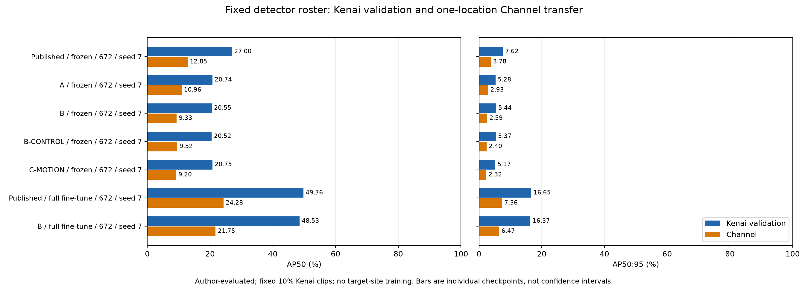
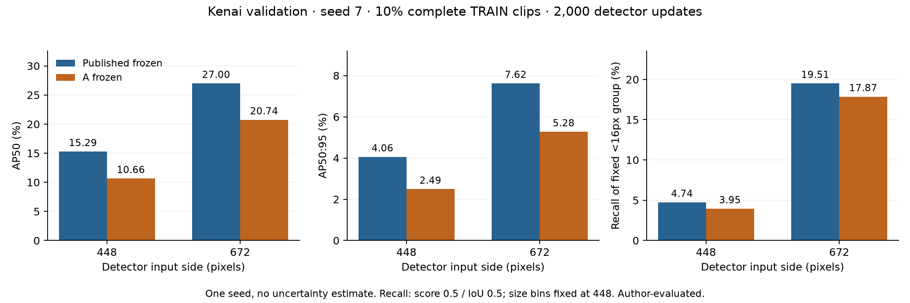
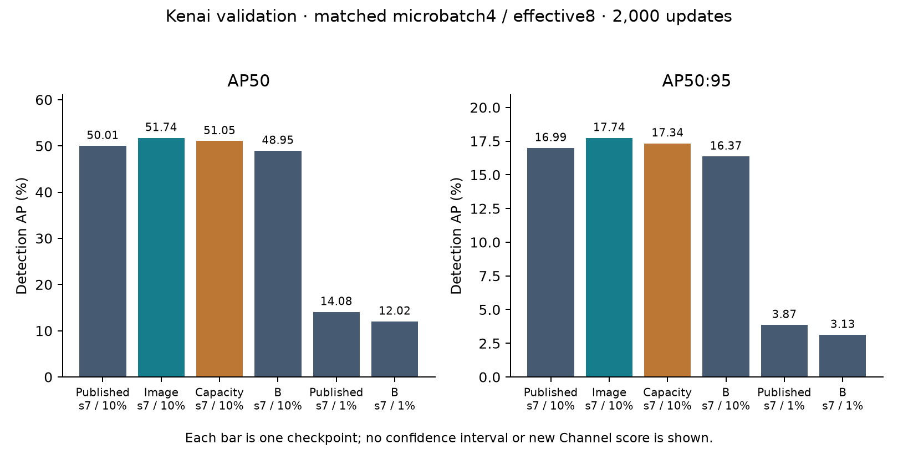

# Execution and results

Latest completed follow-up: The seed-7 image branch passes the practical screen. B initialization provides no label-efficiency improvement in the completed matched pilot. Primary AP50 change +1.7295 percentage points. See the [localization follow-up](#localization-follow-up--completed-author-execution) below for new checkpoints, evaluator v2, resource charges and omissions. Earlier dated sections retain their historical results.

## Final outcome — 2026-10-03 17:36 UTC

The finite continuation is complete: six adapted encoders, fifteen trained detectors, fifteen full Kenai validation evaluations and seven fixed Channel evaluations. All seven Channel checkpoints were evaluated once, without target-site training, threshold tuning or model repair. These are author-evaluated exploratory results, not independent review. The original full fraction/location study remains incomplete.

| Model, seed 7 / 672 / 10% clips | Kenai AP50 (%) | Channel AP50 (%) | Kenai AP50:95 (%) | Channel AP50:95 (%) |
|---|---:|---:|---:|---:|
| Published frozen | 26.9978 | 12.8548 | 7.6219 | 3.7803 |
| A frozen | 20.7433 | 10.9576 | 5.2761 | 2.9263 |
| B frozen | 20.5470 | 9.3323 | 5.4390 | 2.5926 |
| B-CONTROL frozen | 20.5152 | 9.5221 | 5.3663 | 2.3977 |
| C-MOTION frozen | 20.7500 | 9.2027 | 5.1727 | 2.3224 |
| Published full fine-tuning | 49.7605 | 24.2848 | 16.6518 | 7.3644 |
| B full fine-tuning | 48.5271 | 21.7517 | 16.3736 | 6.4665 |



The [SVG](artifacts/final_comparison.svg) and [hashed figure data](artifacts/final_comparison.json) preserve the plotted values. Bars are individual checkpoints, not confidence intervals. The original three-seed negative A448 result remains preserved below.

**Conclusion:** none of the tested adaptation recipes improves frozen detection features under this matched protocol. B also worsens the full-fine-tuning initialization comparison. C does not improve over its paired control on Channel. The controlled resolution increase helps detection, and supervised fine-tuning from published weights is the strongest tested model in both locations. This does not prove that all sonar SSL fails or diagnose A as temporal-JEPA collapse; A has no temporal objective.

### Fixed Channel operating points and saved outputs

All models evaluated the same **13,090 frames, 41,761 boxes and 1,250 negative frames across 69 clips**. AP uses saved predictions down to score 0.001. The following operating points use the unchanged score 0.5 / IoU 0.5. No threshold was tuned on Channel.

| Model | AP75 (%) | Precision (%) | Recall (%) | TP / FP / FN | Negative-frame FP | FP / negative frame |
|---|---:|---:|---:|---|---:|---:|
| Published frozen | 1.2981 | 47.7786 | 11.3048 | 4,721 / 5,160 / 37,040 | 143 | 0.1144 |
| A frozen | 1.1270 | 50.0138 | 8.6732 | 3,622 / 3,620 / 38,139 | 6 | 0.0048 |
| B frozen | 1.0812 | 59.5179 | 4.6120 | 1,926 / 1,310 / 39,835 | 4 | 0.0032 |
| B-CONTROL frozen | 0.3830 | 60.5253 | 3.9175 | 1,636 / 1,067 / 40,125 | 0 | 0.0000 |
| C-MOTION frozen | 0.3508 | 57.6571 | 4.2192 | 1,762 / 1,294 / 39,999 | 0 | 0.0000 |
| Published full fine-tuning | 2.0826 | 40.2806 | 29.1516 | 12,174 / 18,049 / 29,587 | 2,152 | 1.7216 |
| B full fine-tuning | 1.5540 | 32.9751 | 26.5224 | 11,076 / 22,513 / 30,685 | 2,359 | 1.8872 |

Published/B full fine-tuning produces at least one false positive on **81.60%/83.92%** of negative Channel frames. Better AP does not establish a useful deployment operating point. Zero negative-frame FP for the paired frozen arms accompanies very low recall. No target-based threshold repair followed these observations. COCO `AP_large`/`AR_large` is -1 where the corresponding target size bin has no valid ground truth; that value denotes an undefined metric, not negative accuracy.

| Model | Saved detections | Raw predictions | Complete per-image COCO state | Channel charged hours |
|---|---:|---|---|---:|
| Published frozen | 943,994 | [JSON](artifacts/det-published-r672-f010-s7/channel/predictions.json) | [gzip JSON](artifacts/det-published-r672-f010-s7/channel/coco_eval_images.json.gz) | 0.37483917 |
| A frozen | 857,505 | [JSON](artifacts/det-adapted-r672-f010-s7/channel/predictions.json) | [gzip JSON](artifacts/det-adapted-r672-f010-s7/channel/coco_eval_images.json.gz) | 0.27194028 |
| B frozen | 779,613 | [JSON](artifacts/det-b-r672-f010-s7/channel/predictions.json) | [gzip JSON](artifacts/det-b-r672-f010-s7/channel/coco_eval_images.json.gz) | 0.27163611 |
| B-CONTROL frozen | 768,643 | [JSON](artifacts/det-control-r672-f010-s7/channel/predictions.json) | [gzip JSON](artifacts/det-control-r672-f010-s7/channel/coco_eval_images.json.gz) | 0.42806861 |
| C-MOTION frozen | 812,079 | [JSON](artifacts/det-motion-r672-f010-s7/channel/predictions.json) | [gzip JSON](artifacts/det-motion-r672-f010-s7/channel/coco_eval_images.json.gz) | 0.56156250 |
| Published full fine-tuning | 883,034 | [JSON](artifacts/det-finetune-r672-f010-s7/channel/predictions.json) | [gzip JSON](artifacts/det-finetune-r672-f010-s7/channel/coco_eval_images.json.gz) | 0.49802528 |
| B full fine-tuning | 1,004,539 | [JSON](artifacts/det-b-finetune-r672-f010-s7/channel/predictions.json) | [gzip JSON](artifacts/det-b-finetune-r672-f010-s7/channel/coco_eval_images.json.gz) | 0.47912306 |

Every `channel/` directory also contains full scalar metrics, COCO text, arrays, evaluator parameters, prediction identity, exposure start, resource record and console log. [Final execution verification](artifacts/final_execution_verification.json) records checkpoint, prediction, metrics and complete evaluator hashes. The [combined CSV](artifacts/continuation-summary/results.csv) and [summary JSON](artifacts/continuation-summary/results_summary.json) separate recipe, resolution, fraction and location; single-seed cells have no invented sample standard deviation.

### Freeze, acquisition, replay and final resources

The [roster](artifacts/final_roster.json) froze at **14:38:47 UTC**, before the exposure journal began at **14:39:04 UTC**. The fixed block finished at **17:36:22 UTC**. Freeze SHA-256: `141a160155504a796a4544f2461e418851d87a1d31e0ea476dc66a77cf907f71`. Final verification confirms unchanged source, protocol, allocation, roster, checkpoints and labels, seven completed single attempts, and no remaining GPU-owner lock. Earlier annotation-header/structural-metadata exposure remains disclosed; Channel cannot be described as untouched in future work.

Official CFC v1.1 grayscale `channel.tar` is 1,680,528,910 bytes. Publisher/local MD5: `16db94bef9af773b725301811f695e13`; local SHA-256: `d057073e4ce96fb0195273b915d5246213645d6e49cf96046d93ac7d6ea79ead`. Acquisition used fresh legitimate publisher redirects from the [official file link](https://data.caltech.edu/records/g945x-41103/files/channel.tar?download=1). The data-root provenance records retrieval at 14:40:14 UTC. The [inventory](artifacts/channel_inventory.json) found 13,159 archive images / 1,690,911,573 expanded bytes, all 13,090 official filenames present, and 69 unused extras retained. No Channel cache or full 672 cache was created. The earlier API HTTP403 remains distinct from this successful ordinary file download. Dataset usage terms and source licenses remain documented in the existing provenance records.

CPU replay of all 943,994 published-frozen Channel detections reproduced every scalar metric, arrays bitwise, evaluator parameters and complete decompressed per-image output. The initial strict stdout assertion also compared three elapsed-time lines and failed on different runtimes. Both raw outputs and the failed log are preserved. The [follow-up verification](artifacts/det-published-r672-f010-s7/channel/rescore_verification/verification.json) excluded only those runtime fields and verified all scientific content without changing or rerunning the scoring method. Exact final replay wall time/native peak was not reported because the initial assertion stopped before that report; a concurrent project-process snapshot measured 4.27 GB total RSS. The replay used no GPU. This is author verification, not independent review.

| Budget account | Charged hours | Cap / remaining |
|---|---:|---|
| Follow-up block | 17.96083750 | 24 cap; 6.03916250 unused |
| Fixed Channel block | 2.88519500 | Within the protected 6-hour reserve |
| Overall research balance | 29.46504664 | 70.53495336 remaining from 100 |
| Historical original-block accounting | 12.04503830 | Original 24-hour cap preserved |

The random evaluation counts under both applicable block caps but once overall. The historical ledger prefix is unchanged; final ledger SHA-256 is `8ce67c6cccb1480d803d97940e28a9d0ebd517786d21a216f35cc2903a6a8585`. Follow-up sampled peak physical GPU use was 9,444,524,032 bytes (about 8.8 GiB); highest recorded GPU-job owned RAM peak was 5,205,512,192 bytes (about 4.85 GiB). Failed probes and historical interruptions remain charged and preserved. Unused final allowance does not reopen development after target exposure.

### Omitted cells, limits and next research intervention

Original 1%/100% grids remain `DEFERRED_BY_OWNER_PRIORITY_AMENDMENT`. New B/C seed-13/23 replications are `NOT_QUALIFIED_PREDECLARED_SCREEN`; independently, complete paired motion replication was forecast at 20.1016 hours before any C score. The optional new 1% pair is `NOT_RUN_BUDGET`: its complete matched forecast exceeded the 2.9244 development hours available before freeze. Original 448/random Channel cells were outside the bounded roster; their Kenai evidence is retained. Missing cells are not negative models.

B full fine-tuning loses 1.2334 AP50 points on Kenai and 2.5331 points on Channel against the matched published initialization. C changes Kenai AP50 by +0.2348 points over control while lowering AP50:95; on Channel it lowers AP50 by 0.3194 points. New recipes have only one seed. Three original optimizer seeds are not three independent locations. No full label-efficiency curve, clip-bootstrap interval, full CFC benchmark, tracking/counting evaluation, species or biomass claim, Marine Instruments validation, or operational deployment validation is supported.

The next intervention was recorded in PROTOCOL **before Channel outcomes**: one matched detector-neck comparison from published initialization, adding native stride-4/8 grayscale convolutional features fused with the DINO patch grid against the current resampled-final-grid neck. Kenai small-object misses, weak high-IoU proposals, localization errors and the stronger supervised reference motivate this hypothesis. Keep SSL losses unchanged in that contrast. This intervention is not implemented or admitted here, and a gain is not guaranteed. Future work needs a newly declared evaluation policy; Channel is now exposed and must not be reused as untouched validation.

The final status and figures above supersede running/pending statements in the dated history below. Those historical entries preserve execution evidence and are not instructions to restart completed work.

## Finite development completed; fixed Channel block running

At the **2026-10-03 14:38 UTC freeze**, six adapted encoders (three A seeds, B, B-CONTROL and C-MOTION) and fifteen detector fits have completed; all fifteen detectors have full Kenai validation scores. The original negative A findings remain unchanged. The new development choices were post-hoc, informed by Kenai; they do not complete the original 1%/10%/100% fraction study.

The selected-resolution results below all use seed 7, 672 input, the same 49 complete labelled TRAIN clips, 2,000 detector updates and effective batch 8. All seven exposure counters match exactly (16,000 presentations /10,356 unique images). Full validation is 30,454 frames /18,551 boxes /20,529 negative frames. AP uses saved score>=0.001 predictions; operating diagnostics use score 0.5 /IoU0.5.

| Model | AP50 (%) | AP50:95 (%) | AP75 (%) | Precision (%) | Recall (%) | Negative-frame FP | Saved detections |
|---|---:|---:|---:|---:|---:|---:|---:|
| Published frozen | 26.9978 | 7.6219 | 1.6004 | 65.9294 | 21.8533 | 75 | 1,298,803 |
| A frozen | 20.7433 | 5.2761 | 0.8053 | 54.0415 | 19.4976 | 197 | 1,297,016 |
| B frozen | 20.5470 | 5.4390 | 1.4190 | 59.7426 | 16.0153 | 79 | 1,115,719 |
| B-CONTROL frozen | 20.5152 | 5.3663 | 1.1251 | 61.7856 | 15.0342 | 66 | 1,270,528 |
| C-MOTION frozen | 20.7500 | 5.1727 | 0.7800 | 59.5308 | 17.3737 | 78 | 1,276,003 |
| Published full fine-tuning | 49.7605 | 16.6518 | 6.3982 | 69.7005 | 47.9273 | 596 | 661,598 |
| B full fine-tuning | 48.5271 | 16.3736 | 6.4977 | 69.2063 | 46.9085 | 527 | 615,715 |

**Decision:** B loses to published initialization in both frozen and full-fine-tuned comparisons. C gains only 0.2348 AP50 points over its paired control, loses0.1937 AP50:95 points, and remains6.2478 AP50 points below published frozen features. Neither new recipe passes its declared replication rule. No seed was selected for being best; seed 7 was the declared pilot. Complete C/control replication was independently forecast at 20.1016h before seeing C scores and cannot fit the remaining development budget. No additional configuration is admitted.

The finite decision and omissions are saved in [finite_development_decision.json](artifacts/finite_development_decision.json) and [final_roster.json](artifacts/final_roster.json). Original optional 1%/100% cells remain `DEFERRED_BY_OWNER_PRIORITY_AMENDMENT`; the optional new1% pair is `NOT_RUN_BUDGET`. These are missing experiments, not negative results. The original A448 comparison is the only completed three-seed adaptation contrast.

The [freeze](artifacts/freeze.json) at 14:38:47 UTC fixes all seven detectors, source/input/evaluator hashes and label policy before the official Channel download. Its SHA-256 is `141a160155504a796a4544f2461e418851d87a1d31e0ea476dc66a77cf907f71`. The forecast is 5.249685 GPU-process hours including one identical replay, within the protected6h reserve. The exposure journal began at 14:39:04 UTC and retains prior annotation-header/structural-metadata exposure. No target score has yet been reported in this section.

### Measured model-only inference latency

Eight fixed filename-hash-selected TRAIN images; four warmups and ten measured batches per model/batch size. Inputs already reside on GPU; decode, loading and COCO evaluation are excluded. Sequential measurements and changing hardware conditions preclude interpreting these differences as causal recipe speedups or deployment throughput. Raw wall/CUDA timings and checkpoint hashes are in [latency.json](artifacts/final-latency/latency.json).

| Model | Batch1 median ms/frame | Batch8 median ms/frame |
|---|---:|---:|
| Published frozen | 17.474 | 10.761 |
| A frozen | 17.404 | 11.049 |
| B frozen | 19.775 | 11.202 |
| B-CONTROL frozen | 20.553 | 11.811 |
| C-MOTION frozen | 19.943 | 12.789 |
| Published full fine-tuning | 31.835 | 16.135 |
| B full fine-tuning | 20.052 | 11.094 |

Completed charges before Channel are **26.57985164h overall**, of which **15.07564250h** belong to the24h follow-up block. Remaining: **8.92435750h follow-up**, **73.42014836h overall**. The historical original block used 12.04503830h; its24h cap and ledger remain preserved. Later Channel charges must be added, not substituted.


## Continuation execution (matched B comparison complete, 2026-10-03 10:21 UTC)

The owner adopted the supplied spatial/motion assignment prospectively. Original unrun 1%/100% cells are `DEFERRED_BY_OWNER_PRIORITY_AMENDMENT`. Channel imagery stays closed until the finite development block freezes; its earlier annotation-header exposure remains disclosed. The original full fraction/location study is incomplete.

The existing random checkpoint now has a full evaluation: [metrics](artifacts/det-random-f010-s7/val/metrics.json), [1,346,841 saved low-threshold detections](artifacts/det-random-f010-s7/val/predictions.json), and complete COCO output. AP50 is 9.5298308%, AP50:95 2.5822646%, and AP75 0.5956386%. At score 0.5, precision is 55.5133%, recall 3.9351%, TP/FP/FN are 730/585/17,821, and negative-frame FP is zero over 20,529 negatives. Its low false-positive count accompanies low recall; this is one diagnostic seed.

Random evaluation charged 0.54082917 GPU-process hours, including CPU scoring. Original-block use is now 12.04503830 hours, leaving 11.95496170 under its historical 24-hour cap. The charge appears only once overall and also counts within the follow-up cap. After diagnosis (0.01594194 hours) and profiling (0.00139333 hours), cumulative use at admission of the first 672 training job was 12.06237358 hours: 0.55816444 of the additional 24 hours, leaving 23.44183556 including the protected six-hour final reserve. Add the active training interval before later admissions; this paragraph records an admission-time balance.

### Bounded proposal diagnosis

The [fixed subset](artifacts/proposal_diagnosis/subset.json) contains eight filename-hash-selected frames per validation clip: 512 frames, 314 boxes and 342 negatives. Selection uses neither labels nor model outcomes. Capturing RPN outputs left first-batch final predictions bitwise unchanged for every model. Raw proposals, objectness scores and final boxes are retained. This is a diagnostic sample, not full-set AP.

| Seed-7 encoder | RPN recall@100 IoU .5 | RPN recall@200 IoU .5 | RPN recall@200 IoU .75 | RPN-covered GT lacking final score-.5 coverage | Negative proposals with objectness ≥ .5 |
|---|---:|---:|---:|---:|---:|
| Published | 54.78% | 60.83% | 7.96% | 162 / 314 | 542 |
| A | 48.09% | 52.55% | 8.92% | 144 / 314 | 342 |
| Full supervised fine-tune | 71.02% | 72.93% | 24.52% | 95 / 314 | 96 |
| Random | 38.54% | 43.95% | 4.78% | 125 / 314 | 176 |

Coverage is not COCO one-to-one matching. RPNs emit up to 200 proposals even on negatives; proposal objectness counts are separate from final detection FP. Both missing proposals and post-proposal classification/localization/threshold failures contribute. Fine-tuning improves proposal quality, so resolution is not established as the sole cause of the frozen-feature gap.

Saved full-validation predictions reproduce the original seed-7 operating-point confusion counts. Published false positives comprise 973 localization errors (best same-category IoU .1–.5), 62 duplicates and 30 background errors. A has 1,242 localization errors, 58 duplicates and 147 background errors. These describe observed boxes, not a diagnosis of temporal collapse: A never used temporal pairing.

### Verification preceding the completed resolution experiment

The focused suite passed **35 tests** in 82.21 seconds, covering known-answer COCO scoring, complete clip membership, exact legacy-448 state/prediction regression, 672 resize/cache identities, actual patch/register shapes, pyramid/anchor/ROIAlign conventions, masked-patch correspondence, teacher stop-gradient, independent centers/mask RNG and preserved budget accounting. An earlier collection attempt failed with Windows WinError 1455 while evaluation was active; no test or GPU work executed in that failed process. The retry passed after memory headroom recovered. No system setting or unrelated process was changed.

The 672 frozen profile trained on 32 sampled real TRAIN images across four batches, including JPEG decode and transfer. Batch times were 1.282 seconds initially, then 0.265/0.281/0.297 seconds. Reloaded predictions were identical and an actual next optimizer-update replay passed tolerance. Physical GPU peak was 3,242,196,992 bytes; owned RAM peak was 2,960,916,480 bytes. Profiling is engineering evidence, not a research detector. Full 672 caching is rejected; existing 448 assets remain intact. The published 672 detector completed its declared 2,000 updates at 2026-10-03 00:12 UTC, charging 0.5961025 GPU-process hours. Its final checkpoint SHA-256 is `caeb86511dadc2aaf75d83f29e59a0df5e0fccb42a288ee9c8279afeb5d0544d`. Artifact checks confirm frozen encoder identity and exactly matched image-exposure counters against the original 448 run. A672 completed 2,000 updates at 2026-10-03 00:46 UTC, charging 0.52202694 hours. Its checkpoint SHA-256 is `38e8aa935e5007da956434fb037fcffa8fb0b0d81a85c8321980e683edf92beb`. The four-arm artifact check confirms identical full per-image exposure counters and unchanged frozen encoders. Both published-672 and A672 full validations are complete (below). B has declared implementation and passing unit tests; its real profile, adaptation and downstream experiments still remain.

### First completed resolution score: published encoder, seed 7

Full Kenai validation of the published 672 detector completed at **2026-10-03 01:52 UTC**: **AP50 26.9978%, AP50:95 7.6219%, AP75 1.6004%**. The matching 448 reference scored 15.2853% / 4.0586% / 0.6880%. AP50 therefore improves by **11.7126 percentage points**. At score 0.5, precision is 65.9294%, recall 21.8533%, TP/FP/FN are 4,054/2,095/14,497, and 75 false positives occur across 20,529 negative frames. All 1,298,803 low-threshold predictions and complete evaluator output are saved in `artifacts/det-published-r672-f010-s7/val`.

Validation charged 1.08175333 GPU-process hours, with peak owned RAM 4,888,571,904 bytes and physical GPU 3,103,784,960 bytes. The initial one-hour estimate was low; the prospectively revised 1.4-hour allowance covered execution. A672 validation is running. Saved-output analysis reproduced the operating-point counts and found below-16-pixel recall of 19.5088% (3,241/16,613), up from 4.7433% (788/16,613), under the same original 448-based size bins. Negative-frame FP rose from 10 to 75. All metric criteria now favor 672; the final decision still awaits completion of the matched pair and the resource check; no B benefit follows from this published-encoder improvement.

### Completed resolution decision and B execution

Both 672 detectors and full 30,454-frame evaluations completed by **2026-10-03 02:43 UTC**. The declared rule selects **672**: all AP, fixed-small-object recall and resource criteria pass. Every arm has 2,000 detector updates, 16,000 presentations and exactly matched image-exposure counters. The pair charged **3.0579125 GPU-process hours**. Resolution metadata, raw detections, complete COCO outputs, source snapshots and the decision hashes are retained.

| Encoder | Input | AP50 (%) | AP50:95 (%) | AP75 (%) | Recall below 16px (%) | Negative-frame FP |
|---|---:|---:|---:|---:|---:|---:|
| Published | 448 | 15.2853 | 4.0586 | 0.6880 | 4.7433 | 10 |
| A | 448 | 10.6641 | 2.4921 | 0.3564 | 3.9487 | 25 |
| Published | 672 | 26.9978 | 7.6219 | 1.6004 | 19.5088 | 75 |
| A | 672 | 20.7433 | 5.2761 | 0.8053 | 17.8655 | 197 |



The figure is reproduced by `.venv/Scripts/python.exe analysis/plot_resolution.py` from `artifacts/resolution_decision.json`; its source hashes and SVG are saved beside the PNG. It contains no additional fitting or uncertainty estimate.

Small-object recall uses the same 16,613 original below-16-pixel boxes at score 0.5 and IoU 0.5; bins remain defined at 448 for both resolutions. Negative-frame FP uses all 20,529 negatives. A672 has TP/FP/FN 3,617/3,076/14,934 and precision/recall 54.0415%/19.4976%. Its false positives comprise 228 duplicates, 2,375 localization errors and 473 background errors under the saved-output analysis. A remains 6.2545 AP50 points below published at 672, so the resolution gain is not an SSL win. Poor high-IoU performance and remaining small-fish misses warrant the spatial B test; the resolution pilot does not establish a single failure mechanism.

The integrated suite passed **42 tests** in 21.31 seconds. Real B profile/resume checks are now executing. B has not yet produced a final research encoder or detector result. The full B programme includes a fresh frozen detector and matched B/published full fine-tuning at 672, using unchanged 224/112 SSL crops. At closure of the resolution pair, cumulative charged use was 15.12028608 hours, including 3.61607694 in this follow-up; 20.38392306 follow-up hours remained, with 14.38392306 available for development and six reserved for final evaluation. All subsequent probes and fits are additional charges.

### B preflight correction and actual research fit

Initial bitwise B replay failed. All first probes are retained. A fresh uninterrupted replay showed essentially the same drift as the resumed trajectory: encoder relative-L2 differences about 1.3e-7, with exact RNG/exposure identity. The revised real test verifies exact loaded model/optimizer/centers/RNG state, then bounds continuation drift against a fresh replay under the prospectively recorded numerical limits. It passed; this does not establish bitwise-identical GPU training. The exact nondeterministic operator was not isolated.

The 672 full-fine-tuning profile fit in memory and reproduced reloaded predictions exactly. Its first optimizer tolerance failed; a replacement two-replay probe then exposed mutable AdamW CPU step aliasing in the test harness. Reloading the disk checkpoint for each replay fixed the harness without changing research training or the newly declared bounds. The successful profile is `artifacts/profile-b8-finetune-r672-v3/profile.json`; both failed attempts and charges remain. Its physical GPU peak was 7,006,584,832 bytes. All differences are engineering records, not negative model results.

**The full B seed-7 adaptation has started**, from the published initialization, with 2,000 declared updates and effective batch 16. No final B weights or detection metrics are claimed yet. The conservative mandatory-block forecast is 9.8265 GPU-process hours versus 14.3374 development hours available at admission, with six final-evaluation hours protected. `artifacts/spatial_block_forecast.json` retains the measured assumptions. The private workspace had sufficient space for the bounded B artifacts; no full 672 cache is created.

### Completed B encoder and downstream execution

B seed 7 completed all **2,000 SSL updates** at **2026-10-03 04:54:55 UTC**, charging **1.88150167 GPU-process hours**. The final EMA encoder is `artifacts/ssl-B-s7/encoder.pt`, SHA-256 `972ff06e32e7ce59b2b7625c6254f20c92505da76a692193630134d187ab3954`. Its full checkpoint, source snapshot, losses, resource record and artifact verification are saved alongside it. All 32,000 image presentations and 29,017 unique TRAIN frames match A seed 7; full per-image counters, image-generator state and final CPU augmentation RNG also match. Both centers are distinct, all modules are finite, and the export equals the final teacher exactly.

The final logged global/patch losses are 6.14637/7.53277; neither is detection evidence. Relative-L2 weight change from published initialization is 0.00370225. Physical GPU peak was 5,270,142,976 bytes and owned RAM peak 2,062,827,520 bytes. At encoder closure, cumulative charges were **17.04834136 hours**, leaving **18.45586778** in this follow-up, including the protected six-hour reserve. The subsequent B frozen and full-fine-tuning results are reported below. This encoder-closure record alone establishes no detection benefit.

B's frozen detector completed 2,000 updates at **2026-10-03 05:31:54 UTC**, charging **0.59666222 GPU-process hours**. Its checkpoint is `artifacts/det-b-r672-f010-s7/checkpoint.pt`, SHA-256 `a84d2616e454e71f377815d2d8c354874ac371adcbcb25fca4fc0a879a1a9840`. The [matched artifact check](artifacts/spatial_B_frozen_training_identity.json) verifies identical complete exposure counters for published/A/B at 672 (16,000 presentations, 10,356 unique frames) and bitwise identity of each frozen encoder to its own initialization. Physical GPU peak was 3,164,602,368 bytes; owned RAM peak 2,531,143,680 bytes. Full Kenai evaluation subsequently completed, as reported below. At training closure, cumulative use was 17.64500358 hours, with 17.85920556 follow-up hours remaining, including the protected six-hour reserve.

### B frozen detection result: negative at the selected resolution

Full Kenai validation completed at **2026-10-03 06:35:20 UTC** on all 30,454 frames. [Raw detections](artifacts/det-b-r672-f010-s7/val/predictions.json) contain **1,115,719** boxes at the original 0.001 threshold; [metrics](artifacts/det-b-r672-f010-s7/val/metrics.json), complete per-image COCO output, evaluator arrays/parameters and scorer text are retained. No threshold or checkpoint selection was performed.

| Frozen encoder, seed 7, 672 | AP50 (%) | AP50:95 (%) | AP75 (%) | Precision at .5 (%) | Recall at .5 (%) | Negative-frame FP |
|---|---:|---:|---:|---:|---:|---:|
| Published | 26.9978 | 7.6219 | 1.6004 | 65.9294 | 21.8533 | 75 |
| A | 20.7433 | 5.2761 | 0.8053 | 54.0415 | 19.4976 | 197 |
| B | 20.5470 | 5.4390 | 1.4190 | 59.7426 | 16.0153 | 79 |

B is **6.4508 AP50 percentage points below published** and 0.1963 points below A. It fails the predeclared frozen-feature replication screen. Its higher AP75 and slightly higher AP50:95 than A do not offset the negative primary contrast with published features. This is one seed and one B recipe; it does not establish that masked-patch adaptation generally fails. The [screen record](artifacts/spatial_B_frozen_screen.json) preserves exact scores, metric hashes and the still-pending matched fine-tuning screen.

At score 0.5 / IoU 0.5, B has TP/FP/FN **2,971 / 2,002 / 15,580**. Its 79 negative-frame false positives occur across 20,529 negatives, or 0.0038482 per negative frame. Saved-output analysis reproduces these counts and splits FP into **116 duplicates, 1,692 localization errors and 194 background errors**. Fixed below-16-pixel recall is **14.5067% (2,410/16,613)** versus published 19.5088% and A 17.8655%. B matches 0/241, 161/5,656, 2,249/10,716 and 561/1,938 objects in the original <4, 4–8, 8–16 and ≥16-pixel bins. Fewer false positives than A accompany lower recall; they are not an unqualified improvement.

Validation charged **1.04835917 GPU-process hours**, including CPU scoring. Peak owned RAM was 4,537,991,168 bytes and physical GPU 3,103,784,960 bytes. At closure, cumulative charged use was **18.69336275 hours**; **16.81084639** follow-up hours remained, including the protected six-hour final reserve. The mandatory matched full-fine-tuning comparison followed this negative result. Motion and replication admission depend on that completed comparison and measured forecasts. Channel remained closed at this stage.

### Completed B full-fine-tuning fit

B full fine-tuning at 672 completed 2,000 updates at **2026-10-03 07:24:57 UTC**, charging **0.82532972 GPU-process hours**. Checkpoint SHA-256 is `b9b2eea92e41a0901a6899a1f1236c38174530e07d07d4b3c866ec7e6b3c0d8f`. The [exposure check](artifacts/B_frozen_finetune_exposure_identity.json) verifies exactly matched complete image counters against B frozen. The saved `finetuning_verification.json` confirms 175 changed encoder tensors, finite model state and all active optimizer counters at 2,000; both head and encoder were trained. Physical GPU peak was 7,138,705,408 bytes and owned RAM peak 2,541,084,672 bytes. The subsequent B validation score and matched published-reference execution are reported below; training completion alone is not a supervised-comparison result.

Cumulative charges at this training closure were **19.51869247 hours**. The follow-up retained **15.98551667 hours**, including the six-hour final reserve; live evaluation time is additional.

### Completed B full-fine-tuning evaluation; matched reference running

Full Kenai validation completed at **2026-10-03 08:22:53 UTC**: **AP50 48.5271%, AP50:95 16.3736%, AP75 6.4977%**. All 30,454 frames were evaluated, with **615,715** retained low-threshold detections and complete COCO outputs saved in `artifacts/det-b-finetune-r672-f010-s7/val`. At score 0.5 / IoU 0.5, precision is 69.2063%, recall 46.9085%, and TP/FP/FN are **8,702 / 3,872 / 9,849**. The 527 false positives on 20,529 negative frames give 0.0256710 per negative frame.

Validation charged **0.95630639 GPU-process hours**, with owned RAM peak 3,589,455,872 bytes and physical GPU peak 3,115,319,296 bytes. Cumulative use reached **20.47499886 hours**, leaving **15.02921028** in the follow-up, including six reserved final-evaluation hours. The matched published-initialization full fine-tune at 672 has started. Comparing B's new fine-tuned score with the older published 448 score would confound initialization with resolution; that is not the SSL comparison. No replication or motion admission decision is based on that unmatched contrast.

### Primary-source assessment

[MotionJEPA](https://arxiv.org/html/2609.23881v1) motivates prediction of a learned signed-difference latent from paired frame representations, with anti-degeneracy handling on both branches. Its full world model uses actions absent here. The official implementation was inspected at `b3c2fb374b7c69f169de15774f371290a8736f56`. No repository license was found in the retrieved API/tree; no implementation source was incorporated or executed. Any pilot here is an independently implemented sonar adaptation, not a full reproduction.

[Slow-feature bias](https://arxiv.org/html/2211.10831v1) studies temporal prediction under distractors, including a moving-dot environment, latent regularization and action prediction. It motivates a hypothesis, not a diagnosis of CLS-only A. [FAR](https://arxiv.org/html/2609.34677v1) uses future predictive utility for retrieval within a diffusion world-model instantiation; retrieval remains deferred. [PixelUMM](https://arxiv.org/html/2609.38597v1) combines raw-pixel understanding/generation under different objectives and substantial multimodal training; it is outside this detector continuation. Retrieved versions and hashes are in `artifacts/sources/continuation/provenance.json`. B's implemented semantics are grounded in the pinned Apache-2.0 DINOv2/iBOT code.

### Published full-fine-tuning reference: completed training

The matched published reference completed 2,000 updates at **2026-10-03 09:19:29 UTC**, charging **0.94048194 GPU-process hours**. Its checkpoint SHA-256 is `06fa8ffb31baa3208a249d46e6c2e96e69c8d66dde598134d954f11e9dd93bb5`. The [paired artifact check](artifacts/B_published_finetune_training_identity.json) confirms exactly matching full image-exposure counters and supervised settings for B and published: 16,000 presentations, 10,356 unique frames, the same 49 complete clips, 672 input, head LR 3e-4 and encoder LR 1e-5. Both runs actually updated 175 encoder tensors and both optimizer groups completed 2,000 updates. The published encoder changed by relative L2 0.00314663 from its initialization; this is training verification, not a quality measure.

Physical GPU peak was 8,817,475,584 bytes and owned RAM peak 2,538,975,232 bytes, within the limits. Cumulative charges reached **21.41548080 hours**, leaving **14.08872833** follow-up hours including six reserved final hours. Its full Kenai validation is running; the matched fine-tuning comparison remains pending.

### Matched full-fine-tuning result: B is below published

Both seed-7 detectors completed the identical 672/10%-clip/2,000-update/effective-batch 8 comparison. The final published validation completed at **2026-10-03 10:21:52 UTC**, on all 30,454 frames, with 661,598 saved low-threshold detections and complete COCO outputs.

| Full fine-tuning initialization | AP50 (%) | AP50:95 (%) | AP75 (%) | Precision .5 (%) | Recall .5 (%) | Negative-frame FP |
|---|---:|---:|---:|---:|---:|---:|
| Published | 49.7605 | 16.6518 | 6.3982 | 69.7005 | 47.9273 | 596 |
| B | 48.5271 | 16.3736 | 6.4977 | 69.2063 | 46.9085 | 527 |

B's paired changes are **−1.2334 AP50 points** and **−0.2781 AP50:95 points**. It fails the predeclared fine-only screen as well as the frozen screen. No B seed 13/23 replication is selected. The [complete screen record](artifacts/spatial_B_final_screen.json) preserves exact metrics/hashes and the rule identity. The hypothetical complete fine-tuned replication pair forecasts 14.8149 hours against 7.0596 available development hours; the score rule already excludes it, independently of this budget shortfall. These are single-seed comparisons, not evidence that every spatial adaptation recipe must fail.

Published fine-tuning has TP/FP/FN **8,891 / 3,865 / 9,660** at score 0.5/IoU 0.5. Its false positives comprise 152 duplicates, 2,590 localization errors and 1,123 background errors. B has fewer negative-frame FP but also lower recall and lower AP; this does not establish an overall improvement. Both initializations outperform their own frozen detector, which supports using supervised spatial updates in this budgeted setting, not an SSL benefit. Fixed below-16-pixel recall is 46.1446% (7,666/16,613) for published versus 44.7722% (7,438/16,613) for B. In the original <4/4–8/8–16/≥16-pixel bins, published matches 12/1,228/6,426/1,225 objects and B matches 8/1,110/6,320/1,264. B improves the largest-bin operating-point recall but misses more small objects; the overall primary contrast remains negative.

Published validation charged **1.02910167 hours**, with owned RAM peak 3,635,961,856 bytes and physical GPU peak 9,444,524,032 bytes (within the 10 GiB cap). Cumulative charges are **22.44458247 hours**, leaving **13.05962667** in this follow-up: 7.05962667 development and six protected final hours. The optional motion/control pilot has one prospectively declared recipe and a 6.84791597-hour preliminary complete-pair forecast. It is undergoing TRAIN-only calibration and real checkpoint/resource probes; no C/control research training result is claimed at this point. Channel remains closed.

### Conditional paired motion pilot admitted after real prerequisites

The eight focused motion/resume/budget/roster tests passed in 7.46 seconds. The one TRAIN-only calibration used 64 frame presentations and zero optimizer updates. Signed-difference RMS was **0.02999287**, fixing scale **33.34125801**; the predeclared gradient rule fixed coefficient **0.02524451906**. Weighted encoder-gradient ratios were 0.0998543, 0.1232902, 0.1001462 and 0.0313051, with finite nonzero gradients in both learned branches. This is numerical calibration, not fish-detection evidence.

Both four-step real TRAIN profiles passed exact restored-state checks and the previously declared numerical replay bounds. The C/control profiles also have exactly matching complete exposures, all RNG states and patch masks. Motion's resumed encoder relative-L2 error was 6.73855e-8, and auxiliary relative-L2 error 1.96422e-5 (maximum absolute0.000150375), within the prospectively separate auxiliary tolerance. All checks and checkpoints are retained in `ssl-control-resume-check.json`, `ssl-motion-resume-check.json` and the profile directories. Calibration peaked at 7,295,991,808 physical GPU bytes and 2,704,273,408 owned RAM bytes, below the caps.

The [complete-pair forecast](artifacts/motion_block_forecast.json) admits **6.64791597 hours** against **7.04765583** remaining development hours, while protecting six final hours. It covers both 1,000-update continuations, both fresh matched 2,000-update frozen detector heads and both full Kenai evaluations. Unused development sub-budgets cover its excess over the indicative five-hour motion allowance. The control continuation has started from the exact B parent; no motion/control detection result exists yet. This remains the single predeclared temporal pilot, with no coefficient sweep or additional architecture.

### Completed paired spatial control encoder

B-CONTROL completed its declared 1,000 additional spatial updates at **2026-10-03 11:01:26 UTC**, charging **0.58110694 GPU-process hours**. Its 16,000 continuation-frame presentations cover 15,218 unique TRAIN frames, sampled as 8,000 adjacent pairs. This is in addition to the shared parent B's 32,000 presentations; it is not training from published initialization without B.

The [final EMA encoder](artifacts/ssl-control-s7/encoder.pt) contains 88,299,295 bytes, SHA-256 `21b39048540f62de810453ea68233d7f80acdb4bcd6d539a98aa1353c573d7d4`. The complete resume checkpoint contains 444,181,808 bytes, SHA-256 `7e05b28e1ee0b5943194c87d7a4dd6a5267bedb883f38919923526748f2a51f0`. Artifact verification confirms an exact final teacher export, finite modules, distinct global/patch centers, changed teacher weights from B and all inherited optimizer counters advanced by exactly 1,000. A source/protocol snapshot and learning curve are saved alongside it.

Physical GPU peak was 5,635,047,424 bytes and owned RAM peak 2,372,120,576 bytes. Cumulative charges reached **23.03766025 hours**, leaving **12.46654889** follow-up hours, including six protected final hours. The control's fresh matched detector is now training at 672 on the same 10% complete clips for 2,000 updates/effective batch 8. C-MOTION and both full downstream evaluations remain pending; no motion benefit is inferred from this control encoder.

### Completed paired-control detector training

The fresh B-CONTROL frozen detector completed 2,000 updates at **2026-10-03 11:36:45 UTC**, charging **0.58559028 GPU-process hours**. Checkpoint SHA-256 is `2c032b69d1457d87205ab1e09d9a2ec9604d7ad813ae09e3c945ba2b58881843`. Its [matched check](artifacts/control_frozen_training_identity.json) confirms exact full exposure counters versus published and B at 672, with 16,000 presentations across 10,356 unique labelled TRAIN frames, and unchanged frozen encoder tensors. All training settings match the declared detector budget. The final state, source snapshot and learning curve are saved.

Physical GPU peak was 3,485,466,624 bytes and owned RAM peak 2,568,900,608 bytes. Cumulative charges reached **23.62325053 hours**, leaving **11.88095861** in the follow-up, including six protected final hours. Full control validation is running; C-MOTION fitting follows under the already declared recipe and complete-pair admission. No motion-comparison result exists yet.

## Original configuration-A findings and retained history

Author-evaluated exploratory research. No independent review. Original findings retain their **2026-10-02 20:30 UTC** snapshot below. Continuation execution now includes the random-control evaluation (23:33 UTC), bounded proposal diagnosis and 672 profile (23:35 UTC). The adopted policy is appended to [PROTOCOL.md](PROTOCOL.md).

**Configuration A reduced frozen-detector AP50 in all three seeds at 10% labelled Kenai clips.** The mean change is **-4.3219 percentage points**. This answers the first completed comparison; label-efficiency across fractions and cross-location performance remain open.

All three genuine SSL A encoders and all six primary detector heads completed 2,000 updates each. The fine-tuning and random-feature detector controls also completed 2,000 updates. All eight original detectors now have full validation; the existing random checkpoint was evaluated without retraining. The table below contains the six scored primary detectors, each on the same 30,454 official validation frames. AP50 is a percentage, and changes are percentage points.

| Seed | Published frozen | Adapted frozen | Paired change (points) |
|---:|---:|---:|---:|
| 7 | 15.2853 | 10.6641 | -4.6212 |
| 13 | 15.6095 | 11.3871 | -4.2224 |
| 23 | 16.1196 | 11.9974 | -4.1222 |

Across seeds, published AP50 is **15.6714 +/- 0.4206**, adapted AP50 is **11.3495 +/- 0.6674**, and the paired change is **-4.3219 +/- 0.2640** points. These are means and sample standard deviations. The three seeds measure training variation on one fixed clip subset and validation set; they do not measure variation across locations or independently sampled datasets. No significance claim follows from this table.

The saved [primary contrast](artifacts/primary_validation_contrast.json) records the exact AP50 calculations. Other metrics, recomputed from the six completed `val/metrics.json` files, support the same direction:

| Metric | Published frozen, mean +/- sample SD | Adapted frozen, mean +/- sample SD |
|---|---:|---:|
| AP50:95 (%) | 4.1152 +/- 0.1949 | 2.7194 +/- 0.1985 |
| AP75 (%) | 0.6885 +/- 0.0729 | 0.3888 +/- 0.0854 |
| Precision at score 0.5 / IoU 0.5 (%) | 54.5605 +/- 4.6242 | 46.6903 +/- 5.2944 |
| Recall at score 0.5 / IoU 0.5 (%) | 8.6842 +/- 1.9464 | 6.0895 +/- 0.6318 |

Negative-frame false positives, in seed order 7/13/23, are **10/16/10** for published features and **25/0/19** for adapted features, each over 20,529 negative frames. This diagnostic is mixed. The zero count for adapted seed 13 coexists with 959 false positives on other frames and 5.73% recall. Low negative-frame counts alone do not establish a useful detector. AP uses saved detections down to score 0.001; the precision/recall table uses the declared 0.5 operating point.

The controlled contrast supports a narrow conclusion: **this DINO-style adaptation setting harms detection transfer under this frozen-head protocol**. It does not show that all sonar SSL fails. It also does not establish the effect of adaptation on Channel, at 1% or 100% labels, or after longer training. Keep A's negative results and existing final checkpoints; further training solely to reverse the sign would change the question.

The comparison uses matched head initialization, complete labels from the same 49 clips, equal 2,000-update budgets and identical per-image exposure counters within each pair. Author checks verify finite exported encoder tensors and equality to the final EMA teachers. Known-answer scoring, geometry and checkpoint-resume tests passed; CPU rescoring reproduced the first pair's saved metrics. These checks support execution validity, while an undiscovered defect remains possible.

## Original-block training inventory

In the original block, three separate SSL adaptations and eight detector training runs reached their declared final update; continuation runs are reported above. All detector runs in this report use the fixed 10% clip subset. Each run's `exposure_summary.json`, `curve.jsonl`, `config.json` and trained checkpoint support the training counts below. A missing evaluation receives no score and does not count as a negative result.

| Detector run | Updates | Presentations | Unique TRAIN frames | Training hours, all segments | Validation hours | Status |
|---|---:|---:|---:|---:|---:|---|
| `det-published-f010-s7` | 2,000 | 16,000 | 10,356 | 0.521628 | 1.309480 | Training and full validation complete |
| `det-adapted-f010-s7` | 2,000 | 16,000 | 10,356 | 0.636289 | 0.625078 | Training and full validation complete |
| `det-published-f010-s13` | 2,000 | 16,000 | 10,264 | 0.239336 | 0.338589 | Training and full validation complete |
| `det-adapted-f010-s13` | 2,000 | 16,000 | 10,264 | 0.215373 | 0.256194 | Training and full validation complete |
| `det-published-f010-s23` | 2,000 | 16,000 | 10,313 | 0.203993 | 0.262483 | Training and full validation complete |
| `det-adapted-f010-s23` | 2,000 | 16,000 | 10,313 | 0.314562 | 0.454800 | Training and full validation complete |
| `det-finetune-f010-s7` | 2,000 | 16,000 | 10,356 | 0.549171 | 0.574527 | Training and full validation complete |
| `det-random-f010-s7` | 2,000 | 16,000 | 10,356 | 0.456641 | 0.540829 | Training and validation complete |

Training hours sum all charged ledger segments for that run, including continuation probes and interruptions. For example, published seed 13 includes its four-update continuation probe. These values are not just the last segment's `resources.json`. Validation hours include inference and subsequent CPU COCO evaluation while the GPU process remains alive; they are conservative process-time charges, not hardware-utilization integrals.

| SSL seed | Updates | Presentations | Unique TRAIN images | Total charged hours | Relative encoder L2 change |
|---:|---:|---:|---:|---:|---:|
| 7 | 2,000 | 32,000 | 29,017 | 3.930692 | 0.002986083 |
| 13 | 2,000 | 32,000 | 29,073 | 0.284505 | 0.002912227 |
| 23 | 2,000 | 32,000 | 28,977 | 0.278077 | 0.002921952 |

The SSL seed-7 total includes its resource stop, forced interruption, replayed work, continuation probe and final segment. It is much slower than seeds 13 and 23 under the recorded changing hardware/resource conditions; it is not evidence that the seed changes computational complexity. All encoders remain genuine final EMA exports rather than initialized checkpoints. Final logged diagnostics are:

| Seed | Final logged SSL loss | Teacher entropy | Batch marginal entropy | CLS feature standard deviation | Distinct argmax prototypes / 32 views |
|---:|---:|---:|---:|---:|---:|
| 7 | 6.07438 | 6.04410 | 6.91502 | 0.99048 | 4 |
| 13 | 6.46387 | 6.43000 | 7.31380 | 0.99986 | 5 |
| 23 | 4.73877 | 4.71415 | 5.61769 | 1.00778 | 5 |

These quantities describe the last logged batch, not population estimates. Few winning prototypes among 32 views and differing entropy values deserve investigation, but neither establishes feature collapse. The three detector outcomes provide the downstream evidence. The implementation keeps all logged attempts, including repeated step ranges after replay; a learning-curve plot must not connect those ranges as one uninterrupted trajectory.

Saved plots for the first matched milestone are available for the [published detector](artifacts/det-published-f010-s7/learning_curves.png), [adapted detector](artifacts/det-adapted-f010-s7/learning_curves.png) and [SSL A encoder](artifacts/ssl-A-s7/learning_curves.png). The underlying [published](artifacts/det-published-f010-s7/curve.jsonl), [adapted](artifacts/det-adapted-f010-s7/curve.jsonl) and [SSL](artifacts/ssl-A-s7/curve.jsonl) logs retain numeric updates, loss components, learning rates and resource observations. The later runs also retain their own `curve.jsonl`; this report does not claim that a plot has been generated for every run. Falling training loss is not a substitute for validation AP or evidence of convergence.

The completed detectors each saw 16,000 presentations. Seed-7 published, adapted, fine-tuned and random runs report the same 10,356 unique frames. Seeds 13 and 23 report 10,264 and 10,313 respectively for each primary pair. Every annotation in a selected image remains available; the sampler never drops an annotated fish and treats it as background. Equal unique counts alone are weaker than equality of the complete per-image exposure counters; the audit coverage section distinguishes those checks.

## Original-block Kenai evaluations

All eight original scored detectors use the same 30,454 validation frames, 18,551 annotated fish and 20,529 negative frames. Precision, recall and confusion counts below use score 0.5 and IoU 0.5. AP columns use the full saved predictions down to score 0.001 and the COCO evaluator. No threshold has been tuned from these results.

| Encoder/control | Seed | AP50 (%) | AP50:95 (%) | AP75 (%) | Precision (%) | Recall (%) | TP / FP / FN | Negative-frame FP |
|---|---:|---:|---:|---:|---:|---:|---|---:|
| published | 7 | 15.2853 | 4.0586 | 0.6880 | 55.9917 | 7.3042 | 1,355 / 1,065 / 17,196 | 10 |
| adapted | 7 | 10.6641 | 2.4921 | 0.3564 | 42.3046 | 5.7194 | 1,061 / 1,447 / 17,490 | 25 |
| published | 13 | 15.6095 | 3.9548 | 0.6159 | 49.3899 | 10.9105 | 2,024 / 2,074 / 16,527 | 16 |
| adapted | 13 | 11.3871 | 2.8070 | 0.4856 | 52.5717 | 5.7301 | 1,063 / 959 / 17,488 | 0 |
| published | 23 | 16.1196 | 4.3321 | 0.7617 | 58.2999 | 7.8379 | 1,454 / 1,040 / 17,097 | 10 |
| adapted | 23 | 11.9974 | 2.8590 | 0.3243 | 45.1947 | 6.8190 | 1,265 / 1,534 / 17,286 | 19 |
| finetune | 7 | 45.4791 | 14.8833 | 5.2896 | 67.6499 | 44.6283 | 8,279 / 3,959 / 10,272 | 538 |
| random | 7 | 9.5298 | 2.5823 | 0.5956 | 55.5133 | 3.9351 | 730 / 585 / 17,821 | 0 |

Within the original 448 block, the separately labelled supervised fine-tuning control is the strongest result: **45.4791% AP50 and 14.8833% AP50:95**, with **44.6283% recall** at the declared operating point. Its AP50 gain over the seed-7 published frozen detector is **30.1939 percentage points**, and over the seed-7 adapted frozen detector is **34.8151 points**. This comparison uses the same labelled clips and head-step budget, but fine-tuning updates the encoder with labels. It is therefore a different supervision/training condition, not evidence of an SSL gain. Only seed 7 has been evaluated for fine-tuning; the later matched 672 comparison is reported above.

Fine-tuning also increases false positives on negative frames to 538, or **0.026207 per negative frame**; 2.4648% of negative frames contain at least one false positive. Its higher recall comes with an operating-point tradeoff. The frozen models' low false-positive counts must be read alongside their low recall. Published frozen seed 7 exceeds random by 5.7554 AP50 points. A exceeds random by only 1.1343 points, while its AP50:95 is slightly lower than random. Beating random cannot support an adaptation benefit.

Raw detection files and complete per-image evaluator state exist for all eight original scores:

| Run | Saved detections | Prediction file | Full evaluator output |
|---|---:|---|---|
| `det-published-f010-s7` | 1,463,149 | [JSON](artifacts/det-published-f010-s7/val/predictions.json) | [Per-image state](artifacts/det-published-f010-s7/val/coco_eval_images.json.gz) |
| `det-adapted-f010-s7` | 1,384,945 | [JSON](artifacts/det-adapted-f010-s7/val/predictions.json) | [Per-image state](artifacts/det-adapted-f010-s7/val/coco_eval_images.json) |
| `det-published-f010-s13` | 1,368,456 | [JSON](artifacts/det-published-f010-s13/val/predictions.json) | [Per-image state](artifacts/det-published-f010-s13/val/coco_eval_images.json.gz) |
| `det-adapted-f010-s13` | 1,345,175 | [JSON](artifacts/det-adapted-f010-s13/val/predictions.json) | [Per-image state](artifacts/det-adapted-f010-s13/val/coco_eval_images.json.gz) |
| `det-published-f010-s23` | 1,696,839 | [JSON](artifacts/det-published-f010-s23/val/predictions.json) | [Per-image state](artifacts/det-published-f010-s23/val/coco_eval_images.json.gz) |
| `det-adapted-f010-s23` | 1,859,990 | [JSON](artifacts/det-adapted-f010-s23/val/predictions.json) | [Per-image state](artifacts/det-adapted-f010-s23/val/coco_eval_images.json.gz) |
| `det-finetune-f010-s7` | 572,723 | [JSON](artifacts/det-finetune-f010-s7/val/predictions.json) | [Per-image state](artifacts/det-finetune-f010-s7/val/coco_eval_images.json.gz) |

Each `val/` directory also contains `metrics.json`, `coco_output.txt`, `evaluator_params.json`, `coco_arrays.npz`, `prediction_identity.json` and resource/log records. Original large JSON evaluator outputs from the first pair remain retained; later outputs use lossless gzip. The saved prediction count reflects low-threshold candidate detections across the complete validation set, not the number of true fish or the score-0.5 true-positive count.

## Error evidence and limits

At the 448-pixel detector input, **16,613 / 18,551 validation boxes (89.55%) have a resized short side below 16 pixels**. The backbone patch width is 14 pixels. Seed-7 recall by object size, measured at score 0.5 / IoU 0.5, is:

| Resized short side | Ground-truth boxes | Published recall (%) | Adapted recall (%) |
|---|---:|---:|---:|
| Below 4 pixels | 241 | 0.000 | 0.000 |
| 4 to below 8 pixels | 5,656 | 0.336 | 0.230 |
| 8 to below 16 pixels | 10,716 | 7.176 | 6.000 |
| At least 16 pixels | 1,938 | 29.257 | 20.898 |

Sources: [published size bins](artifacts/det-published-f010-s7/val/errors_by_resized_short_side.json) and [adapted size bins](artifacts/det-adapted-f010-s7/val/errors_by_resized_short_side.json). Bin assignment uses the recorded pre-rounding resize scale; scoring uses original coordinates. These size results cover seed 7, not a three-seed size analysis.

Small-object recall and low AP75 motivate a resolution/localization experiment. They do not isolate its cause: proposal coverage, box regression, feature quality, optimization and score calibration can all contribute. Training losses decreased, but this does not establish convergence or adequate detection quality. A global crop-distillation objective may emphasize background over small fish; that is an untested explanation. Teacher entropy, prototype usage and nonzero weight changes neither prove collapse nor demonstrate useful spatial features.

Label fractions describe available complete clips. Every current detector receives 16,000 frame presentations through sampling with replacement. Availability is:

| Fraction | Clips | Frames | Boxes | Negative frames | Presentations / available frames at 2,000 updates |
|---|---:|---:|---:|---:|---:|
| 1% | 5 | 1,952 | 1,782 | 1,016 | 8.197 |
| 10% | 49 | 16,859 | 11,728 | 10,705 | 0.949 |
| 100% | 482 | 162,198 | 132,010 | 92,544 | 0.099 |

These ratios are not completed epochs or unique coverage. The seed-7 10% heads visited 10,356 unique frames. Even a completed 100% run would be a fixed-compute experiment with all labels available, not a detector trained through the full dataset. Report actual unique frame and annotation exposure with any label-efficiency curve. SSL A processed 32,000 presentations and about 29,000 unique TRAIN images per seed; this limited adaptation budget also constrains the conclusion.

## Completion boundary and remaining work

The report contains actual adapted weights, actual detector weights and eight complete saved-prediction evaluations. It does **not** complete the initial research question across label fractions and locations.

| Requested component | Verified state at 20:30 UTC |
|---|---|
| Published frozen versus adapted frozen, 10%, seeds 7/13/23 | Complete; adaptation is worse in all three seeds |
| Supervised fine-tuning, 10%, seed 7 | Training and validation complete |
| Random frozen diagnostic, 10%, seed 7 | Initially unscored; completed at 23:33 UTC without retraining |
| Nested 1% and 100% manifests | Prepared and counted; no detector runs at these fractions |
| Fixed Channel model/policy freeze | No `artifacts/freeze.json` exists |
| Channel images and fixed evaluation | No image acquisition in provenance, exposure journal or model scores |
| 672-pixel detector comparison | No trained model or evaluation |
| Configuration B / patch-level SSL | Not executed; only A has research results |
| Independent review | Has not occurred |

At the snapshot, the GPU lock was absent, the ledger had no unmatched start event, and the previously recorded serial parent PID was absent. The old [continuation invocation](artifacts/continuation_invocation.json) records an intended queue, not proof that it remains active or that its later stages executed. That earlier documentation-only turn did not restart jobs; the owner subsequently authorized the current execution amendment.

At that earlier snapshot, follow-up files in `analysis/`, `tests/test_diagnostics.py` and `artifacts/resolution-stage/` were unvalidated drafts. The current continuation inspected and integrated the resolution changes, passed 35 focused tests, and executed the bounded diagnosis and real 672 profile described below. Historical tests retain their recorded source scope.

The earlier metadata listing displayed a few Channel annotation/clip headers. Preserve that exposure. No Channel image or model score has informed the reported experiments. Official Channel list counts, 69 clips / 13,090 frames, were read only for compute reservation. A future Channel evaluation must follow completion or documented runtime-based omission of the declared comparisons and a model/policy/code freeze. Its result would represent one held-out location rather than the full CFC benchmark.

## Resource accounting and interruptions

The [resource ledger](artifacts/resource_ledger.jsonl) records **11.504209 GPU-process hours** charged at this snapshot. The initial 24-hour block has **12.495791 hours** remaining; the user's original 100-hour remaining overall allocation has **88.495791 hours** remaining. No allocation was reset. There is no open ledger interval to add at the report snapshot.

Charges cover real-batch GPU profiles, SSL, detector training, validation processes and failed/replayed work. CPU-only data preparation and separate CPU rescoring of saved predictions have wall-time records and are not GPU charges. Durations in the ledger measure the active lifetime of a GPU job, including its CPU scoring phase; they do not estimate NVIDIA utilization-weighted time.

Seed-7 SSL first stopped when aggregate physical GPU memory reached 11,206,131,712 bytes (10.44 GiB), despite the project's own allocated CUDA peak of about 2.37 GiB. Later continuation slowed under observed low GPU clocks and a 25 W software power cap; Windows reported AC power. No power setting, GPU safety control or unrelated process was changed. A second forced stop targeted only the identity-verified project process after aggregate memory again exceeded the ceiling. The durable checkpoint held step 1,600 while the last logged successful step was 1,776. At least 176 successful unsaved updates were lost; their cost remains charged, and replay did not inflate the final successful-update count.

The resume probe reproduced update 1,601's recorded loss and diagnostics; its gradient-norm difference was 1.0133e-6, within the declared tolerance. Training then reached the genuine 2,000-update encoder. Checkpoints and resource records preserve the interruptions.

Windows event 32897035 confirms hibernation from 2026-10-01 23:02:08.9418439 UTC to 2026-10-02 06:54:33.4061905 UTC. Only that verified 7.873462-hour suspension was excluded from the first baseline validation charge. Its raw 9.182943-hour interval became 1.309480 active process hours. Original ledger and OS evidence remain retained. An accounting amendment and a union/overlap known-answer test record this correction.

Later native Windows RAM accounting captured peaks missed by infrequent samples. For example, adapted seed-23 validation recorded a 5.825 GiB owned peak, and fine-tuning training recorded approximately 6.684 GiB aggregate physical GPU use. Earlier first-pair records relied on sampled RSS, so they cannot establish an exact historical native peak. Resource-limit incidents are execution facts, not evidence of adaptation quality.

## Verification, provenance and audit coverage

The [recorded post-milestone suite](artifacts/post_milestone_tests.log) passed **16 tests in 9.00 seconds**. The later [evaluator writer checks](artifacts/row_writer_tests.log) passed **3 focused tests in 23.16 seconds**; these are not three additional independent scientific experiments. The recorded warnings concern intentionally unavailable/disabled xFormers.

Checks covered deterministic nested clip membership and complete labels; known-answer COCO perfect/missed/false-positive cases; image/category IDs; empty negative frames; grayscale and rounded box transforms; teacher stop-gradient, centering and EMA; checkpoint optimizer/RNG resume; head initialization; native resource accounting; and cache identity/corruption/storage behavior. Real TRAIN examples supported geometry and optimizer-resume checks. A 128-frame check verified exact cached-versus-original detector tensors, labels and resize scales.

CPU rescoring reproduced all saved scalar metrics for the first published/adapted pair at numeric tolerance 1e-12. The adapted rescore also reproduced full COCO arrays bitwise and evaluator parameters exactly. Published rescoring took 472.410 CPU seconds and peaked at 3,435,077,632 bytes native owned RAM; adapted rescoring took 778.072 seconds and peaked at 3,241,316,352 bytes. These are author verifications, not independent reviews.

The [completed-model audit](artifacts/completed_model_audit.json), timestamped 15:24:06 UTC, covers all three SSL exports and five then-completed detectors. It verifies finite exported encoder tensors, exact equality to the final EMA teacher, the image-only TRAIN exposure restriction, update counts, and the covered detectors' frozen encoder/optimizer properties. It includes exact paired image-exposure counter equality for seeds 7 and 13. Its timestamp precedes the later adapted seed-23 validation and the control completions; this report does not silently expand that audit's scope. All eleven final encoder/detector artifact hashes were recomputed while preparing this report; hashing is an identity check, not a fresh finite-tensor audit.

The [configuration comparison](artifacts/matched_configuration_all_primary.json) covers all three primary pairs. Models, data, label fractions, optimizer budgets and head settings match within each pair. Source/protocol hashes are not identical for every pair: seed 7 spans the documented suspension-accounting change, seed 13 spans the lossless evaluator serialization change, and seed 23 has identical code/protocol identities. Those differences are disclosed rather than presented as byte-identical whole experiments. The cache change preserves the tested detector input transform; SSL continues reading original TRAIN JPEGs.

Data acquisition verified publisher MD5 and local SHA-256 for the four named archives. The 44,074,741,065-byte `kenai.tar` is gzip-compressed despite its filename; extraction produced 193,198 JPEGs. Only 192,652 frames appear in the official TRAIN/validation lists. The 546 extra frames remain on disk and are excluded. All 546 official Kenai clips have one fewer listed frame than the older shared metadata; manifests preserve the mutually agreeing v1.1 annotations and lists. Local [dataset provenance](<D:/sonar-representation-lab-data/provenance.json>) and [protocol](PROTOCOL.md) retain sizes, versions, URLs, hashes and usage terms. D: was selected because E: lacked space for archive, extraction and cache; no other project's data was removed.

CFC's downloaded record declares MIT rights; DINOv2 source/checkpoint use follows its official Apache-2.0 license. The private environment pins Python 3.12.13, PyTorch 2.11.0+cu128, torchvision 0.26.0+cu128 and pycocotools 2.0.11. The complete dependency lock and exact source/checkpoint identity are linked from [README.md](README.md).

## Interpretation and next research decision

The executed three-seed contrast supports a negative result for configuration A at 10% clips under this frozen-detector budget. The effect is larger than the observed spread among these seeds, but that descriptive comparison is not a significance test. Three optimizer seeds on the same clips do not estimate generalization across independently sampled locations or label subsets.

The completed supervised control shows that changing the encoder with labelled detection gradients can greatly improve this pipeline. It does not prove that more SSL steps, patch distillation or larger crops will reproduce that gain. The subsequent random evaluation supplies a 9.5298% AP50 diagnostic reference. A 2,000-step detector with replacement sampling also does not establish convergence or a fully trained 100%-label ceiling.

The most direct next model intervention remains the previously recorded 448-versus-672 resolution comparison, motivated by small-object misses and weak localization. Reuse the same published/adapted encoders, train matched fresh heads, change resolution alone, and use fixed 448-reference size bins. The [Kenai-only intervention record](artifacts/next_intervention_from_kenai_validation.json) predates any Channel image exposure. The detailed prospective pilot budget and decision criteria remain in [README.md](README.md#continuation-plan). They are recommendations; this documentation update does not execute them or amend the original experimental protocol.

Close the original missing evaluations and fixed-location comparison before treating the research question as answered. If a stronger spatial detector still shows harmful A transfer, a single declared patch-level SSL change is a later hypothesis. Preserve all attempted configurations and seeds, and do not search until SSL wins. Any later use of Channel after its first fixed evaluation must acknowledge the previous exposure.

The [official CFC guide](https://github.com/visipedia/caltech-fish-counting/tree/main/CFC) reports grayscale baseline AP50 of 66.4 on validation and 32.0 on Channel using YOLOv5m at 896 resolution for 150 epochs. Architecture, resolution and supervised budget differ, so these are source-reported context rather than a matched baseline. Its alternative three-channel results use a different representation. [ALDI, TMLR 2025](https://openreview.net/pdf?id=ssXSrZ94sR) uses additional unlabelled target-site data in CFC-DAOD; its target-adaptation setting differs from the source-only generalization planned here. [SCOPE, WACV 2026](https://rsq0504.github.io/assets/pdf/SCOPE_WACV26.pdf) studies sonar compression/correction with different data and evaluation. The dated [comparator check](artifacts/sources/comparator_check_20261002.json) is not an exhaustive leaderboard.

No independently reviewed, SOTA, operational fish-counting, tracking, species, biomass or Marine Instruments validation claim follows from these results. The report distinguishes source facts, author execution checks, provisional detection measurements and future hypotheses throughout.

## Earlier execution notes

The notes below preserve observations and budgets at their original stages. Statements such as “pending” and earlier cumulative totals describe those times; the snapshot above gives the status used for the continuation plan.

All three SSL exports passed CPU-only author verification: finite encoder tensors, bitwise equality to final EMA teacher states, complete-update counts, matched saved configurations and exposures restricted to the separate image-only official Kenai TRAIN manifest. Seeds 13 and 23 each processed 32,000 presentations / 29,073 and 28,977 unique TRAIN frames respectively. Encoder SHA-256: seed 13 `243cef3824e30edefce9c7a507a6dc3af25e0b161d2f88e8dd2ade4dbd66fccb`; seed 23 `41345e0e978c880c3d8e0371379b35cee3f85df5080dc52f29bebbf5a1ad122d`. Completed paired detectors have identical per-image exposure counters, unchanged frozen encoders, finite model tensors and head optimizer step counts at 2,000. These are execution checks, not independent review. The full audit is `artifacts/completed_model_audit.json` and will be extended after all attempted runs complete.

First matched milestone, complete author evaluation at 10% / seed 7:

| Frozen encoder | AP50 (%) | AP50:95 (%) | Precision (%) | Recall (%) | FP on 20,529 negative frames |
|---|---:|---:|---:|---:|---:|
| Published DINOv2 | 15.2853 | 4.0586 | 55.9917 | 7.3042 | 10 |
| Sonar-adapted A | 10.6641 | 2.4921 | 42.3046 | 5.7194 | 25 |

Both evaluated all 30,454 official validation frames. Operating point is score 0.5 / IoU 0.5. Adapted TP 1,061 / FP 1,447 / FN 17,490; saved raw detections 1,384,945. AP50 difference is **-4.6212 percentage points**; AP50:95 difference is -1.5665 points. This is one completed paired seed, not a replicated conclusion or independent review. Configuration A remains fixed for the declared replicates; no metric-driven search or second configuration is introduced. Adapted full evaluator output is 1,985,892,622 bytes and raw predictions are 303,231,044 bytes. Full validation ended at 2026-10-02 13:00:21 UTC, charging 0.625078 hours. Completed total is 7.075959 GPU-process hours, leaving 16.924041 in this block and 92.924041 overall.

After this milestone, bookkeeping/storage changes passed all **16 tests**, including native RAM accounting, known-answer compressed evaluator reload and disk-failure completion behavior, deterministic split/full-label checks, optimizer reload, teacher stop-gradient/center/EMA, matched head initialization, cache corruption/manifests and exact input/target/scale equality on 128 real TRAIN frames. The CPU-only Kenai canvas cache decoded all 192,652 official TRAIN/validation frames, wrote 38,666,027,008 bytes, took 955.888 seconds and peaked at 849,809,408 bytes native owned working set. Original JPEGs and archives are retained; the 546 frames outside official lists remain excluded. Cache identity and source hashes are recorded in the data root. These engineering checks do not reverse the measured adaptation result.

Adapted saved-prediction verification completed on CPU: all 1,384,945 raw detections over all 30,454 official validation images reproduced every scalar/text metric (numeric tolerance 1e-12), all COCO precision/recall/score arrays bitwise, and complete evaluator parameters. The verification took 778.072 CPU-wall seconds and peaked at 3,241,316,352 bytes native owned working set. A complete compressed evaluator state is retained under `val/rescore_verification/`. This is author verification, not independent review.

Serialization follow-up: a bounded 128-row engineering benchmark found one buffered `json.dumps` write per row 3.941 times faster than individual gzip token writes; decompressed JSON bytes were identical. The change was applied while seed-13 validation was running, after that detector completed training, and passed three focused evaluator/known-answer/failure tests. Existing in-progress evaluators keep their imported writer implementation and their full actual time remains recorded. Metric computation and scientific settings are unchanged.

Seed-13 published frozen baseline completed 2,000 updates (including the four-update cached-batch continuation probe) and full validation at 2026-10-02 13:43:29 UTC: AP50 15.6095%, AP50:95 3.9548%, precision 49.3899%, recall 10.9105%, TP 2,024 / FP 2,074 / FN 16,527, and 16 false positives on 20,529 negative frames. It saved 1,368,456 raw detections and complete compressed per-image COCO output. Training continuation charged 0.238325 hours, probe 0.001011, validation 0.338589; native validation RAM peak was 5,233,770,496 bytes. Completed total after this baseline is 7.653884 hours, leaving 16.346116 in the initial block. SSL A / seed 13 then started with the unchanged declared objective and original Kenai TRAIN JPEGs; its completed encoder and matched detector remain pending.

SSL completion: the final continuation finished at 2026-10-02 11:43:51 UTC after 5,909.343 active process seconds (1.641484 hours). The exported EMA encoder is `artifacts/ssl-A-s7/encoder.pt`, 88,297,055 bytes, SHA-256 `15b3356ef61f163a955cefd240b04555635b104f7b222dcd408fdb783eaca210`. Across the durable 2,000-update trajectory it saw 32,000 frame presentations and 29,017 unique Kenai TRAIN images. Its relative L2 change from published initialization is 0.00298608319 (0.298608%); this is an execution check, not a detection result. Failed/discarded updates remain charged in the ledger. Completed charges before the running adapted detector total 5.814591 hours, leaving 18.185409 in this block and 94.185409 against the initial overall balance. The fresh matched adapted head began at 11:43:57 UTC with exactly the same 49 labelled clips, seed, head initialization rule and 2,000-update budget as the baseline.

The final SSL encoder passed CPU-only reload verification: all 176 tensors are finite and bitwise equal to the final EMA teacher state, its configuration matches the complete training checkpoint, its teacher center is finite, and all recorded image exposures belong to the image-only official Kenai TRAIN manifest. CPU verification also found all 38 pyramid/RPN/ROI initial tensors identical between the published and adapted seed-7 pipelines. These are author execution checks, not independent review. Final batch diagnostics: teacher entropy 6.0441 nats, marginal entropy 6.9150 nats, across-view CLS feature standard deviation 0.99048, and four distinct argmax prototypes across 32 views out of 4,096 prototypes. Feature variability is measurable, while few dominant argmax prototypes remain a limitation; these diagnostics do not establish patch-feature or detection quality. Raw interrupted/replayed logs are retained.

Matched adapted detector completion: 2,000 updates ended at 2026-10-02 12:22:07 UTC, charging 0.636289 GPU-process hours. Checkpoint SHA-256 `346ca4ca64a64bf05058145b0458cc4156aa476139ec3995c7a2b3e938fb46aa`. CPU reload verified finite model tensors, all head optimizer counters at 2,000, all 176 encoder tensors bitwise unchanged from the adapted initialization, and exact equality of published/adapted image exposure counters (16,000 presentations / 10,356 unique images). The model/data/trainer/evaluator source hashes are identical for this pair; source/protocol differences are limited to the documented suspension-accounting amendment. Completed ledger charges now total 6.450881 hours before running validation, leaving 17.549119 in this block and 93.549119 overall.

Baseline validation error analysis, computed from saved detections at score 0.5 / IoU 0.5: recall by resized box short side is 0/241 below 4 pixels, 19/5,656 (0.336%) at 4–8 pixels, 769/10,716 (7.176%) at 8–16 pixels, and 567/1,938 (29.257%) at 16 pixels or larger. Bins use the explicitly recorded pre-rounding resize scale; the scorer itself uses original coordinates. The saved counts sum to 18,551 objects and 1,355 true positives. Poor small-object recall suggests higher input resolution and a reassessment of feature/anchor scale as a possible next experiment; this is an author hypothesis, not an implemented improvement. The current matched comparison remains unchanged.

Saved-prediction verification: CPU-only rescoring of all 1,463,149 detections on all 30,454 Kenai validation frames reproduced every saved metric field, with numeric tolerance 1e-12. Rescoring took 472.410 CPU-wall seconds and peaked at 3,435,077,632 bytes owned RAM; no GPU was used. A lossless compressed copy of the complete per-image COCO output is 112,111,059 bytes; decompression reproduces the original 2,087,790,788 bytes exactly, SHA-256 `de3b6cf0af8c54fd2703575dc73679041a6c3cf5c8a3d0daf2093d4f60601e8f`. The original is retained. Verification records are saved beside the baseline predictions. Neither author verification constitutes independent review.

GPU capacity became available at approximately 09:58 UTC after the user requested continuation. Before a long continuation, four real SSL updates from the durable 1,600-update checkpoint completed with the unchanged batch 16 / accumulation 1 configuration. The saved checkpoint reached 1,604. Replayed update 1,601 exactly matched the earlier loss, teacher entropy, marginal entropy, feature standard deviation, prototype count, LR, temperature and EMA momentum; gradient-norm absolute difference was 1.0133e-6, within the declared 1e-5 check. The probe charged 0.039258 GPU-process hours, with peak allocated memory 2,540,664,320 bytes and sampled total physical use 6,381,633,536 bytes. The remaining 396 updates then resumed using the same source, protocol and optimizer state. At the end of this probe, no adapted encoder had yet been exported. Completed charges at that point were 4.173107 hours; subsequent segments are recorded below.

At 2026-10-02 09:27 UTC, resumed SSL A / seed 7 had completed at least 1,751 updates. Training slowed from approximately 3–5 to 35 seconds per measured update. Windows reported AC power; NVIDIA reported an active software power cap of 25 W, SM clock 180 MHz, memory clock 405 MHz, and state P8. The read-only hardware report is saved in `artifacts/gpu_conditions_20261002_0927UTC.txt`. No power or safety control was changed. Active process time continues to count against the original allocation.

At 09:41:44 UTC, only this project's SSL process was forcibly stopped after repeated read-only measurements showed aggregate GPU memory above 10 GiB. The slow training had made the existing 25-update resource-check interval too long to wait for a native stop. Process identity, creation time, exact command and project working directory were verified before stopping it. No other process or control was changed. Native exception cleanup was unavailable after forced termination, so the complete OS-epoch process interval (3,527.789 seconds, no verified suspension) was explicitly charged: 0.979941 hours. The original start record and forced-stop identity/resource artifacts are retained. CPU reload verified the latest durable checkpoint at update 1,600 with exact source/protocol identity; the last logged successful update was 1,776. At least 176 successful but unsaved updates were lost and must be repeated, while their compute remains charged. Total charges are 4.133849 hours, leaving 19.866151 in this block and 95.866151 overall. GPU use remained about 8 GiB after the project's training stopped, preventing a safe immediate resume of the profiled batch. This is a resource interruption, not evidence about adaptation quality.

2026-10-01: Empty new workspace; RTX 5070 Laptop-class GPU, reported 12,227 MiB total VRAM; approximately 3,121 MiB initially used by desktop processes. E: free 65.6 GiB, D: free 297 GiB. Private CPython 3.12.13 environment created. CFC API `/api/records/g945x-41103` returned HTTP 403; direct publisher file GETs with project User-Agent succeeded through normal publisher redirects. Web-fetch tool encountered cached/expired redirects, which were not reused.

Verified and extracted official annotation ZIP, split-list ZIP and shared metadata tar.gz. Provenance, sizes, publisher MD5 and local SHA-256 are in `D:/sonar-representation-lab-data/provenance.json`. Its `.tar` filename contains gzip-compressed data. An initial uncompressed partial-tar probe failed `ReadError: invalid header`; this was a data format inspection, not a GPU run. Real grayscale TRAIN and validation frames subsequently decoded successfully. The TRAIN example's image dimensions and two bounding boxes were checked against the actual image. These checks are acquisition and geometry verification, not scientific training results.

Official full Kenai TRAIN: 482 clips, 162,198 frames, 132,010 boxes, 92,544 negative frames. Kenai validation: 64 clips, 30,454 frames, 18,551 boxes, 20,529 negative frames. Clip names match official clip metadata. These are author-verified counts from the downloaded annotations, not measured model performance.

Exposure record: the initial metadata listing displayed a few Channel annotation/clip headers. No Channel images or model scores have been seen. Channel images remain excluded from SSL and model selection.

Budget: user stated 100 GPU-hours remain overall. This project's initial block is capped at 24 GPU-hours, charged to that balance. Every GPU process is recorded in `artifacts/resource_ledger.jsonl`; failed CPU/data checks are separately described here.

Implementation verification: seven tests passed (known-answer COCO AP including negatives/misses, identity rejection, grayscale/rounded resize geometry, nested clip splits, teacher stop-gradient/center/EMA, optimizer checkpoint resume, and complete real manifests). Three real TRAIN detector profiles passed checkpoint prediction reload. Batch 8 frozen: 0.78–1.23 seconds per warmed microbatch; fine-tuned: 1.22–1.52 seconds. Fine-tuned peak allocated CUDA memory 2.07 GiB; sampled total physical GPU memory 6.88 GiB, owned RSS 2.35 GiB. Profiles are engineering verification, not fish-detection research results. The training protocol is fixed at batch 8, accumulation 1, effective batch 8.

All 482 train and 64 validation clips have exactly one fewer frame in the v1.1 COCO/file lists than in the older official clip metadata. Saved discrepancy files preserve this fact; manifests follow the mutually agreeing v1.1 COCO and file lists. Selected 1%: 5 clips / 1,952 frames / 1,782 boxes / 1,016 negative frames. Selected 10%: 49 clips / 16,859 frames / 11,728 boxes / 10,705 negatives. Full counts above define 100%.

Private runtime: Python 3.12's platform identity query encountered WMI error 0x8007000e. Project-local compatibility code uses CPython's documented unavailable-WMI fallback; no Windows service, permission or other environment was changed. An initial profiling filename collided with the standard library `profile`; renamed to `profile_batch.py`. Initial evaluator output serialization and a test tensor comparison were corrected before the seven passing tests. These were development failures, not omitted negative scientific results.

Usage terms: the publisher's actual record HTML declares rights `mit` for CFC v1.1 and shared metadata. Record HTML and CaltechDATA terms retrieved HTTP 200 and saved under `artifacts/sources`; separate usage-terms provenance is saved in the data root. DINOv2 code/checkpoint usage follows the official Apache-2.0 source license. Kenai download once returned a truncated HTTP 200 response; it resumed via HTTP 206 from a freshly resolved publisher link.

Further execution verification: an additional real detector optimizer reload reproduced its next update within the declared numerical tolerance. A matched-initialization test verified identical pyramid/RPN/ROI head weights across published and random encoders, distinct backbone weights, four registers and frozen encoder parameters. The SSL resource probes used one available real TRAIN frame solely to profile mechanics; they did not export adapted research encoders. Batch 16 / accumulation 1 preserves effective batch 16 and reduced probe runtime relative to batch 4 / accumulation 4. Sampled SSL peak allocated memory was 2.35 GiB. These probes do not fulfill the full adaptation milestone.

Acquisition: the large connection truncated a second time. Bounded official HTTP ranges were then used, with content-range verification and a unique query on each original publisher request to prevent cached signed redirects. A TLS EOF interrupted the first bounded-range window; completed chunk files were preserved and the next request resumed them. No certificate check, authorization or platform control was bypassed. At 2026-10-01 20:52:07 UTC the full 44,074,741,065-byte archive passed publisher MD5 `2f6a20c066495af6315147dd66aa2475`; local SHA-256 is `554641e1fdf2c5b617d910e60faee609c974d4381f9aaedc2806936745e55c3b`. Extraction and the all-required-paths check precede the queued seed-7 baseline.

The final pre-training test run passed all eight tests. Channel file-list/clip counts were read only for runtime budgeting: 69 clips, 13,090 official v1.1 frames. No Channel imagery or model performance was used. Optional fraction runs are admitted using measured runtime and a reserved held-out evaluation budget, with the rule fixed before training.

Kenai extraction completed at approximately 2026-10-01 21:25 UTC. Inventory verified 193,198 archive images totalling 44,560,166,609 expanded bytes, with zero missing official v1.1 TRAIN/validation paths. The 546 archive frames outside those official lists remain on disk and are excluded from every training/evaluation manifest. The complete inventory and excluded filenames are saved in `D:/sonar-representation-lab-data/kenai_inventory.json`. Seed-7 published frozen training then began on the fixed 10% manifest; intermediate losses are not detection metrics.

The seed-7 published frozen detector completed all 2,000 updates in 1,877.86 seconds (0.521628 GPU-process hours). It sampled 16,000 frame presentations and 10,356 unique images from the 16,859 available labelled frames. All 49 clips and their complete annotations remained available; a fixed-step budget does not imply every available frame was visited. Sampled owned RSS peaked at 2,554,179,584 bytes and physical GPU use at 4,032,823,296 bytes. Final checkpoint reload succeeded and inference on all 30,454 validation images began. These are verified execution facts, not AP measurements.

Completed seed-7, 10% published frozen baseline on full Kenai validation: AP50 **15.2853%**, AP50:95 **4.0586%**. At score 0.5 / IoU 0.5, precision **55.9917%**, recall **7.3042%**, TP 1,355 / FP 1,065 / FN 17,196. Negative frames: 20,529; negative-frame FP: 10; FP per negative frame 0.000487116. Saved 1,463,149 original-coordinate detections at the declared 0.001 threshold. `artifacts/det-published-f010-s7/val/` contains raw predictions, all metrics, COCO text, parameter/array output and the complete 2,087,790,788-byte per-image evaluator output. This is one author-evaluated seed, not evidence that adaptation helps.

Resource correction: Windows Power-Troubleshooter event 32897035 confirms hibernation from 2026-10-01 23:02:08.9418439 UTC to 2026-10-02 06:54:33.4061905 UTC (7.873462 hours). Validation raw elapsed time was 9.182943 hours; excluding that verified suspension yields 1.309480 active GPU-process hours. The original ledger is retained as `artifacts/resource_ledger_before_suspend_correction.jsonl`, and the XML, interval record and explicit correction are saved. No model or experimental setting changed. Completed charges total 1.883899 hours, leaving 22.116101 in this initial block and 98.116101 against the original overall balance. The new overlap-accounting known-answer test passed; formatter/linter checks passed before SSL.

SSL A / seed 7 started at 2026-10-02 07:16:21 UTC and was interrupted by the physical GPU ceiling at update 1,301. Sampled total device memory reached 11,206,131,712 bytes (10.44 GiB), while the project's peak allocated CUDA memory was 2,544,043,520 bytes (2.37 GiB). The guard stopped the job; no other process was closed and no limit was relaxed. The interruption consumed 1.270009 active GPU-process hours, bringing completed charges to 3.153908 hours. Saved interruption checkpoint and resources are retained separately. CPU reload confirmed 1,301 updates / 20,816 frame presentations / 19,566 unique TRAIN images, finite teacher center, and exact source/protocol identity for resume. No final encoder was exported. Device use later fell to 3,604 MiB, allowing the same configuration to resume without changing its effective batch or objective. This interruption is not a negative adaptation result.

## Paired control evaluation completed — 2026-10-03 12:26 UTC

B-CONTROL completed full Kenai validation: AP50 **20.51520931%**, AP50:95 **5.36634852%**, AP75 **1.12507543%**. At score 0.5 / IoU 0.5: TP 2,789, FP 1,725, FN 15,762; precision 61.78555605%, recall 15.03422996%. Its 20,529 negative frames contain 66 false positives (0.0032149642 per negative frame). All 1,270,528 raw detections and complete COCO outputs are in `artifacts/det-control-r672-f010-s7/val/`. Evaluation charged 0.82862833 GPU-process hours, with physical GPU peak 3,424,649,216 bytes and owned RAM peak 4,956,565,504 bytes.

Relative to B, the extra matched spatial continuation changes AP50 by -0.03183071 percentage points. It remains 6.48261366 points below published frozen features at 672. The motion arm began from the identical B parent after this evaluation; its transforms, paired stream, coefficient and updates were fixed before either continuation fit and are unchanged. No motion detection result exists yet.

## C-MOTION encoder completed — 2026-10-03 13:15 UTC

The declared dynamic arm completed 1,000 updates from the same B parent. Its final encoder SHA-256 is `5ffa15b1b89454ffce98462e69d5089808df4499b1603d4f29591df18481d6f8`; its complete checkpoint SHA-256 is `dabf9240484cbc20e65f8c3458494c912aa802a2a99386843f90e074943b1146`. The [artifact verification](artifacts/ssl-motion-s7/artifact_verification.json) confirms exact paired exposures/RNG/mask states and shared parent/settings against control, finite modules, exact EMA export, and inherited optimizer counters advanced by exactly 1,000. Both arms saw 8,000 TRAIN pairs / 16,000 presentations / 15,218 unique frames. The saved [learning curve](artifacts/ssl-motion-s7/learning_curves.png) describes optimization only. The fit charged 0.80612389 GPU-process hours. Its fresh 672 detector is training; the downstream comparison is not yet scored.

## C-MOTION detector completed — 2026-10-03 13:47 UTC

The fresh matched detector completed 2,000 updates, charging 0.51806861 GPU-process hours. Its checkpoint SHA-256 is `acd910a2fe3b1363eaa5c76b8cff8ecde47207ee42365cd46dba83229dffb97a`. Exact full per-image exposure equality against published/B/control at 672 and frozen-encoder identity passed in `artifacts/motion_frozen_training_identity.json`. All four saw 16,000 labelled frame presentations / 10,356 unique frames. The complete final checkpoint and learning curve are preserved. Full Kenai validation is active. Completed charges before this validation total 25.77607136 hours overall, leaving 9.72813778 hours in the follow-up block, including the protected six-hour final reserve.

## Localization follow-up — completed author execution

The seed-7 image branch passes the practical screen. B initialization provides no label-efficiency improvement in the completed matched pilot. The primary matched changes are AP50 **+1.7295pp** and
AP50:95 **+0.7507pp**; fixed 448-bin below 16 recall changes from
46.313% to48.432% at score 0.5.
All new cells are full supervised fine-tuning at 672 with matched microbatch 4/effective batch 8. These new
scores use positive-annotation-ID evaluator v2; historical tables above remain v1 snapshots.

Label policy remains complete official clips:10% provides49 TRAIN clips,16,859 frames,11,728 annotations
and10,705 negative frames;1% provides5 clips,1,952 frames,1,782 annotations and1,016 negatives.
These are available counts, not claims of exhaustive training. Each completed fit samples16,000
presentations with replacement. Validation retains30,454 frames/18,551 boxes/20,529 negatives in64 clips.
No adjacent-frame random split, partial fish labeling or negative-frame removal was introduced.

| Completed run | AP50 (%) | AP50:95 (%) | AP75 (%) | P / R at0.5 (%) | FP / negative |
|---|---:|---:|---:|---:|---:|
| [det-finetune-r672-f010-s7-mb4](artifacts/det-finetune-r672-f010-s7-mb4/checkpoint.pt) | 50.0115 | 16.9927 | 6.5817 | 69.85 / 48.23 | 0.03088 |
| [det-image-finetune-r672-f010-s7-mb4](artifacts/det-image-finetune-r672-f010-s7-mb4/checkpoint.pt) | 51.7410 | 17.7433 | 7.2017 | 70.83 / 50.32 | 0.03220 |
| [det-capacity-finetune-r672-f010-s7-mb4](artifacts/det-capacity-finetune-r672-f010-s7-mb4/checkpoint.pt) | 51.0510 | 17.3379 | 7.0271 | 71.97 / 49.23 | 0.02889 |
| [det-b-finetune-r672-f010-s7-mb4](artifacts/det-b-finetune-r672-f010-s7-mb4/checkpoint.pt) | 48.9502 | 16.3666 | 6.1121 | 71.01 / 46.10 | 0.02255 |
| [det-finetune-r672-f001-s7-mb4](artifacts/det-finetune-r672-f001-s7-mb4/checkpoint.pt) | 14.0842 | 3.8666 | 1.3256 | 27.58 / 23.10 | 0.28564 |
| [det-b-finetune-r672-f001-s7-mb4](artifacts/det-b-finetune-r672-f001-s7-mb4/checkpoint.pt) | 12.0199 | 3.1320 | 0.6628 | 24.20 / 19.10 | 0.27410 |



- Seed7: image minus published AP50 +1.7295pp; AP50:95 +0.7507pp.
- This contrast remains a single training-seed pilot, not a replicated benefit claim.

At 1% labels, B minus published full fine-tuning changes AP50 by -2.0644pp and AP50:95 by -0.7345pp. Both points use the same five complete clips, seed 7, microbatch 4/effective 8 and 2,000 updates. This is one fixed subset/optimizer-seed curve; it is not a replicated label-efficiency claim or frozen-feature benefit. The freshly trained numerical bridge at 10% labels gives B minus published AP50 -1.0613pp and AP50:95 -0.6260pp. Both fractions use the same microbatch and fixed optimization budget; the old microbatch-8 B endpoint is historical context rather than the matched endpoint of this curve.

Fixed 448-scale size bins and score 0.5 error diagnosis for the seed-7 reference and added branches:

| Seed-7 checkpoint | Recall <4 /4–8 /8–16 /≥16 (%) | Duplicate / localization / background FP |
|---|---|---|
| det-finetune-r672-f010-s7-mb4 | 4.56 / 21.84 / 60.17 / 64.71 | 165 / 2592 / 1105 |
| det-image-finetune-r672-f010-s7-mb4 | 7.88 / 23.92 / 62.28 / 66.46 | 147 / 2487 / 1210 |
| det-capacity-finetune-r672-f010-s7-mb4 | 4.56 / 23.29 / 61.40 / 63.16 | 107 / 2350 / 1099 |

Bounded512-frame Kenai proposal diagnosis, identical recorded selection in both arms:

| Primary checkpoint | RPN recall@200 IoU0.5 /0.75 (%) | Covered but no final coverage | No RPN coverage |
|---|---:|---:|---:|
| det-finetune-r672-f010-s7-mb4 | 77.71 / 20.38 | 106 | 70 |
| det-image-finetune-r672-f010-s7-mb4 | 81.85 / 21.02 | 111 | 57 |

This is object coverage, not one-to-one AP or full-validation proposal recall. The saved rows include
recall@100/200, IoU0.5/0.75, objectness and negative-frame proposals. The instrumentation's first batch
reproduces uninstrumented detections bitwise. Neither these values nor AP75 replace the primary screen.

Measured inference timing on the same eight real TRAIN frames:

| Primary checkpoint | Batch1 warm ms/frame | Batch4 warm ms/frame |
|---|---:|---:|
| det-finetune-r672-f010-s7-mb4 | 250.758 | 71.653 |
| det-image-finetune-r672-f010-s7-mb4 | 214.446 | 72.353 |

These are warm model-only medians, with inputs already on GPU; they exclude decoding, loading and scoring.
Shared-machine timing is descriptive, not a deployment throughput guarantee or proof of a recipe-speed effect.

The hypothesis tested here is access to fine-scale grayscale cues through added detector processing.
It is not a new SSL recipe or proof that14-pixel patch tokens intrinsically erase all subpatch information.
The capacity control, when completed, uses the existing P0 grid and differs slightly in parameter count;
its score must inform mechanism attribution. Replicating image/reference without replicating the capacity
control does not establish a replicated fine-scale-specific mechanism.
At seed 7, capacity minus the matched published reference changes AP50 by +1.0396 percentage points and AP50:95 by +0.3452. Image minus capacity changes AP50 by +0.6900 points and AP50:95 by +0.4054. These are observed checkpoint contrasts, not replicated evidence isolating input detail from compute.
Analytical added-branch cost at 672 is942,907,392 convolution MACs for image versus541,900,800 for
capacity (1.886/1.084 billion FLOPs under two-operations-per-MAC counting). These exclude bias,
normalization, activation, pooling, fusion and the common detector; see architecture_costs.json.
Thus the control is approximately parameter-matched, not FLOP-matched.

The saved-output200-draw whole-clip bootstrap preserves64 clip units, duplicate-ID remapping and
stable score-tie conventions. B minus published fine-tuning AP50 percentile interval is[-2.3868,-0.2217]pp;
its AP50:95 interval is[-0.7058,+0.2106]pp. C minus B-CONTROL AP50 interval is[-0.3577,+0.8482]pp,
AP50:95[-0.3117,+0.1373]pp. These are conditional clip-sampling intervals, not optimizer-seed or
location uncertainty. They do not rescue the original failed practical screens. Existing Kenai-only
threshold-grid operating diagnostics are in`artifacts/localization-block/saved_analysis-v4`; thresholds
are exploratory source-site choices, with no target tuning or replacement of the0.5 historical diagnostic.

| Historical model | Kenai selected score | Precision / recall (%) | FP / negative |
|---|---:|---:|---:|
| det-finetune-r672-f010-s7 | 0.5 | 69.70 / 47.93 | 0.02903 |
| det-b-finetune-r672-f010-s7 | 0.5 | 69.21 / 46.91 | 0.02567 |
| det-control-r672-f010-s7 | 0.25 | 40.76 / 25.17 | 0.03157 |
| det-motion-r672-f010-s7 | 0.25 | 37.91 / 26.74 | 0.03595 |

Correctness disclosure: publisher GTannotation ID 0 collided with COCO's zero sentinel. All15 historical
Kenai scores were audited using saved matches, including the earliest A run's verified identical CPU
replay. Published fine-tuning448 and672 AP50 change by+0.001250 and+0.004833pp respectively; other
historical AP50 values do not change. Original outputs are untouched. The selected historical v2 Kenai
AP metrics are derived from cached matching, not invented new complete evaluator outputs. The new
roster has canonical completev2 output and an exact complete scorer replay. Historical Channel scores
remain v1 with this newly discovered evaluator limitation; this block accesses no Channel data.

Omissions and boundaries:

- replication: NOT_RUN_BUDGET; strongest contrast remains seed7 pilot.
- Original100%-label grid remains DEFERRED_BY_OWNER_PRIORITY_AMENDMENT; no fully trained label ceiling.
- Any completed1%/10% curve uses one fixed nested subset seed and equal2,000-update budgets; it cannot establish a universal label-efficiency curve.
- No new self-supervised encoder was fitted in this localization block. The six real prior SSL encoders remain preserved; any B-labelled new fine-tune starts from the existing B checkpoint. Supervised encoder changes are retained inside every new detector checkpoint.
- No new location result, independent review, SOTA, fish species/biomass, tracking or counting claim.

New block: **13.91030417/24 GPU-process hours**; historical cumulative baseline29.46504664h is retained. Overall spend **43.37535080/100h**, remaining **56.62464920h**. Original and previous block caps are not reset. The complete append-only ledger includes profiles, evaluation and the failed batch8 fit.

The first batch8 image attempt stopped at one successful update after aggregate physical GPU use reached
12,311,330,816bytes due concurrent background allocation. The guard stopped the owned process; the
checkpoint, source, error and0.0169052778h charge remain. It is incomplete, not a negative model result.
The selected microbatch 4 image fit retained a separate Windows memory-query interruption at step971;
its0.4199305556h charge, immutable checkpoint and eight discarded presentations are preserved. Exact
model/optimizer/RNG reload passed before continuing the same2,000-update budget. This was a resource
failure, not a detection result. Successful exposure counts do not silently include discarded updates.
All admitted successful new arms use profiled microbatch 4 with per-microbatch checks, unchanged10GiB
GPU/22GiB ownedRAM caps and preserved unrelated processes. Tests verify branch geometry/gradients,
shared initialization, CPU/CUDA RNG preservation, cache/resolution conventions, known-answer scorer
including annotation ID 0, and loaded checkpoint model/optimizer/RNG. BF16 replay has declared numerical
tolerances; only loaded state and final scorer arrays are asserted bitwise identical.

Artifacts:

- [det-finetune-r672-f010-s7-mb4 weights](artifacts/det-finetune-r672-f010-s7-mb4/checkpoint.pt), SHA-256 `145fdf740c17c4e677849d86cec560b8e2a2dfe425eaa75274926984eaef7068`; [raw detections](artifacts/det-finetune-r672-f010-s7-mb4/val/predictions.json); [complete metrics](artifacts/det-finetune-r672-f010-s7-mb4/val/metrics.json); train/validation charges 1.207222/1.174588h.
- [det-image-finetune-r672-f010-s7-mb4 weights](artifacts/det-image-finetune-r672-f010-s7-mb4/checkpoint.pt), SHA-256 `f913331e608412e8a505c07abc3dd8cdbec8333f4fb4e2e091c13d40242d9998`; [raw detections](artifacts/det-image-finetune-r672-f010-s7-mb4/val/predictions.json); [complete metrics](artifacts/det-image-finetune-r672-f010-s7-mb4/val/metrics.json); train/validation charges 1.107574/1.332956h.
- [det-capacity-finetune-r672-f010-s7-mb4 weights](artifacts/det-capacity-finetune-r672-f010-s7-mb4/checkpoint.pt), SHA-256 `fc4e1628b0927d2e6d325db1d558e2a681d3d39bdd6d8b5503d9eee87c9a84ba`; [raw detections](artifacts/det-capacity-finetune-r672-f010-s7-mb4/val/predictions.json); [complete metrics](artifacts/det-capacity-finetune-r672-f010-s7-mb4/val/metrics.json); train/validation charges 0.934931/1.322956h.
- [det-b-finetune-r672-f010-s7-mb4 weights](artifacts/det-b-finetune-r672-f010-s7-mb4/checkpoint.pt), SHA-256 `a0d6d3ee789e8cbb6ea44cd8beddcedda311131f83032ef2648caca715a28291`; [raw detections](artifacts/det-b-finetune-r672-f010-s7-mb4/val/predictions.json); [complete metrics](artifacts/det-b-finetune-r672-f010-s7-mb4/val/metrics.json); train/validation charges 1.118498/1.302986h.
- [det-finetune-r672-f001-s7-mb4 weights](artifacts/det-finetune-r672-f001-s7-mb4/checkpoint.pt), SHA-256 `e36df12c2db5c7b57679297716c43b7ea811f371a17283212da3d8fb86387a7a`; [raw detections](artifacts/det-finetune-r672-f001-s7-mb4/val/predictions.json); [complete metrics](artifacts/det-finetune-r672-f001-s7-mb4/val/metrics.json); train/validation charges 1.063815/1.044045h.
- [det-b-finetune-r672-f001-s7-mb4 weights](artifacts/det-b-finetune-r672-f001-s7-mb4/checkpoint.pt), SHA-256 `0f3c35b1d16c8edba3ae2ecba4c210a7b8ff109cb5d8b282abb2255c8ac41bb1`; [raw detections](artifacts/det-b-finetune-r672-f001-s7-mb4/val/predictions.json); [complete metrics](artifacts/det-b-finetune-r672-f001-s7-mb4/val/metrics.json); train/validation charges 0.926580/1.224649h.

The final freeze, verification, figure data, proposal/latency diagnostics and ledger live under the existing
artifact structure. No application, second repository or reviewer dependency was introduced.

Next evidence-based decision: The image pilot passes the practical rule, but mechanism and transfer remain limited by the actual capacity-control and replication evidence. The next separately authorized experiment should complete any missing matched capacity/reference/image replications, then freeze a new source-only roster before a new-location test. No Channel repair or new SSL objective follows automatically from this detector gain. B initialization loses both AP metrics at 1% as well as 10% in the matched seed-7 screen. Do not allocate the next block to further tuning of this recipe. Retain these negative results and prioritize replicated supervised localization comparisons.

The next finite experiment should pair all three published-initialized arms at seeds 13 and 23,
preserving the 672 input, 10% complete-clip manifest, microbatch 4/accumulation 2 and 2,000 updates.
Include the seed-7 results already obtained and every new seed; estimate cost from measured complete
fit/evaluation intervals before admission. This tests the reproducibility of the image gain and whether
added processing explains it. It does not require another SSL fit. Only after that comparison should a
new source-only transfer roster be frozen; Channel is already exposed, so a future independent location
is needed for a new untouched-location claim.

The current conservative forecast is 1.5590 GPU-process hours per fit and 1.7162 per full Kenai score.
Six new cells for the two additional three-arm seeds therefore forecast 19.6513 hours before a separate
six-hour final reserve, or 25.6513 hours in total. That does not fit a new 24-hour block if validation
remains charged to development. Do not silently enlarge the cap. A future allocation must either stage
complete seed-matched trios across explicitly authorized blocks, or prospectively freeze all replication
heads before scoring and reserve the measured full scoring budget for final evaluation. Any later
location evaluation needs its own forecast and protection. No three-seed claim is available until both
additional seeds and all matched controls are actually scored.

For localization, the recorded subset has 314 boxes. The image branch gains 13 RPN-covered boxes at
IoU 0.5, but only two at IoU 0.75; 111 proposed objects still lack final score-0.5 box coverage.
Its full-validation background false positives rise from 1,105 to 1,210, and negative-frame detections
from 634 to 661. The capacity control instead has 1,099 background false positives and 593 negative-frame
detections. These tradeoffs justify retaining both added-branch arms in replication, rather than choosing
by AP50 alone. A later model intervention, if the gain survives replication, should address tight box
regression and proposal-to-ROI failures with a separately declared matched localization-head experiment.
The present data do not identify a unique loss, anchor or head change that will fix them.

The practical bottlenecks remain small-object misses, weak tight-box overlap and background false
positives. AP75 and the fixed size-bin counts above quantify localization and miss rates; proposal
coverage further distinguishes objects absent from the proposal set from failures after proposal
generation. These checks motivate the next matched detector experiment. They do not diagnose
configuration A as temporal collapse, identify biological motion, or justify another unbounded SSL search.

```powershell
# Exact finite driver invocation used; do not restart completed development.
$env:SONAR_RESEARCH_ALLOCATION='artifacts/localization-block/allocation.json'
$env:SONAR_RESEARCH_PHASE='development'
$env:SONAR_ORIGINAL_BLOCK_OPERATION='0'
.venv/Scripts/python.exe -u analysis/run_localization_block.py --microbatch 4 --profile artifacts/localization-block/profile-image-mb4/profile.json
# Completed saved-prediction analyses; existing outputs are protected against overwrite.
.venv/Scripts/python.exe -u analysis/clip_bootstrap.py --out artifacts/localization-block/saved_analysis-v4
.venv/Scripts/python.exe -u analysis/evaluator_correction_audit.py
.venv/Scripts/python.exe -u analysis/evaluator_correction_audit.py --runs artifacts/det-adapted-f010-s7 --out artifacts/localization-block/evaluator_correction_audit_A7.json
.venv/Scripts/python.exe analysis/report_localization.py protocol
.venv/Scripts/python.exe analysis/finalize_localization.py freeze
.venv/Scripts/python.exe analysis/finalize_localization.py verify
$env:SONAR_RESEARCH_ALLOCATION='artifacts/localization-block/allocation.json'
$env:SONAR_RESEARCH_PHASE='final'
$env:SONAR_FINAL_FREEZE='artifacts/localization-block/final_freeze.json'
$env:SONAR_ORIGINAL_BLOCK_OPERATION='0'
.venv/Scripts/python.exe analysis/proposals.py --checkpoints artifacts/det-finetune-r672-f010-s7-mb4/checkpoint.pt artifacts/det-image-finetune-r672-f010-s7-mb4/checkpoint.pt --out artifacts/localization-block/final_proposals --batch 4 --allocation artifacts/localization-block/allocation.json
.venv/Scripts/python.exe analysis/latency.py --runs artifacts/det-finetune-r672-f010-s7-mb4 artifacts/det-image-finetune-r672-f010-s7-mb4 --out artifacts/localization-block/final_latency --batches 1 4
.venv/Scripts/python.exe analysis/plot_localization.py
.venv/Scripts/python.exe analysis/report_localization.py documents
```

Every actual fit/prediction argument vector, forecast, allocation and source identity is saved in its
`admission-*.json`; its console and config preserve exact execution. For a future explicitly allocated
fresh reproduction, use `src/train_detector.py train --kind finetune --size 672 --neck image` (or `none`/`capacity`)
with separate fresh output paths, existing manifest, seed, `--steps 2000 --batch 4 --accumulation 2` and
the recorded allocation. Exact primary image training invocation used:

```powershell
$env:SONAR_RESEARCH_ALLOCATION='artifacts/localization-block/allocation.json'
$env:SONAR_RESEARCH_PHASE='development'
$env:SONAR_ORIGINAL_BLOCK_OPERATION='0'
.venv/Scripts/python.exe -u src/train_detector.py train --kind finetune --size 672 --neck image --fraction 10 --seed 7 --steps 2000 --batch 4 --accumulation 2 --out artifacts/det-image-finetune-r672-f010-s7-mb4 --allocation artifacts/localization-block/allocation.json
# Exact recovery invocation after the preserved step-971 resource interruption.
.venv/Scripts/python.exe -u src/train_detector.py train --kind finetune --size 672 --neck image --fraction 10 --seed 7 --steps 2000 --batch 4 --accumulation 2 --out artifacts/det-image-finetune-r672-f010-s7-mb4 --allocation artifacts/localization-block/allocation.json --resume artifacts/det-image-finetune-r672-f010-s7-mb4/checkpoint.pt
.venv/Scripts/python.exe -u src/train_detector.py predict --checkpoint artifacts/det-image-finetune-r672-f010-s7-mb4/checkpoint.pt --out artifacts/det-image-finetune-r672-f010-s7-mb4/val --batch 4 --allocation artifacts/localization-block/allocation.json
```

These preserve executed commands; use fresh paths for a new reproduction rather than overwriting completed runs.
`predict --checkpoint ... --out ... --batch 4 --allocation ...` saves original-coordinate predictions;
`src/evaluate.py --annotations D:/sonar-representation-lab-data/manifests/val.json --predictions ... --out ...`
scores saved predictions without GPU or inference. Use fresh evaluator output paths and identify v2.
